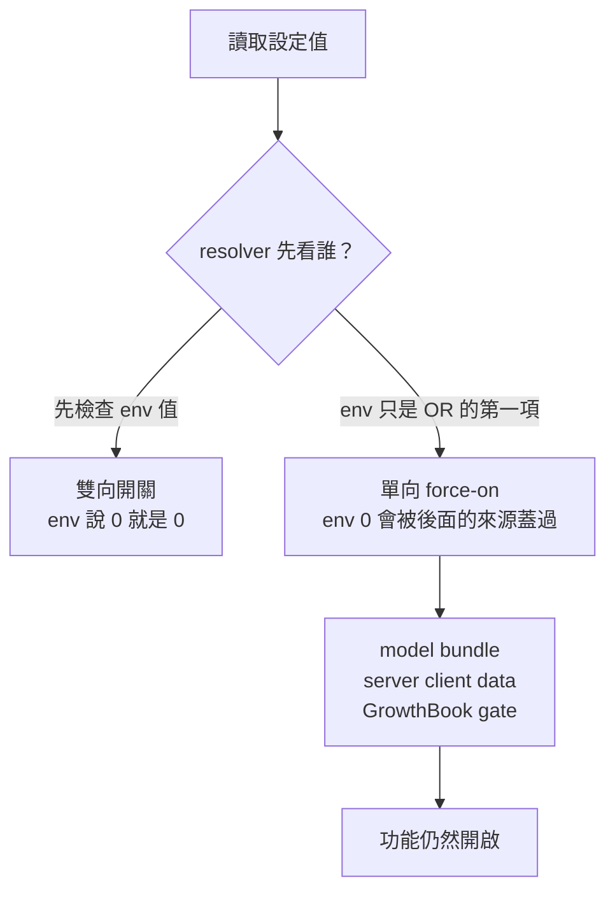

# Hidden settings in native Claude Code

> 繁體中文版本：[`HIDDEN_SETTINGS.zh-TW.md`](./HIDDEN_SETTINGS.zh-TW.md)

> **Pinned artifact:** Claude Code `2.1.239` for **macOS arm64** (`darwin-arm64`), SHA-256
> `2b4f7aafdaa65bcc2335f56a4b276317837203f2c5587b1f2a17ca78ad14e36f`, size `324973552`, embedded
> build revision `9bf8e9521fe06414183309865310e27c9b8db3dd`. Every offset, gate name, and behavior
> claim below applies to that binary only. Re-run the method after each update.

## Document purpose

This is a behavioral map of the environment variables and `settings.json` keys that the native
Claude Code binary accepts but the public reference does not describe. The two populations are
admitted on different terms. In the `2.1.239` inventory an environment variable is listed only when
the binary both declares it in a typed schema and reads it at runtime, whereas a settings key is
listed when the schema accepts it — a weaker bar, and two of the twenty-one turn out to have no
runtime consumer at all, which the [dead-key section](#two-keys-are-declared-but-dead) identifies.
The `2.1.240` differential relaxes the first rule once, admitting `CLAUDE_CODE_SABLE_THRUSH`, which
is read directly without a typed-schema entry and is labeled as such where it appears. It exists
because a patched-binary project needs to know which behavior is already switchable from the
outside before deciding what is worth patching: a flag that flips a prompt section is cheaper and
more upgrade-proof than a byte patch that has to be re-applied on every release. The findings come
from static tracing of the extracted JS bundle, cross-checked against live session transcripts.

## Contents

- [Method and what "hidden" means](#method-and-what-hidden-means)
- [The gate taxonomy that decides whether a flag works](#the-gate-taxonomy-that-decides-whether-a-flag-works)
- [Inventory](#inventory)
- [Case study: the Bash-first injection](#case-study-the-bash-first-injection)
- [Search tools removed in favor of Bash](#search-tools-removed-in-favor-of-bash)
- [Server-delivered prompt text](#server-delivered-prompt-text)
- [Prompt and behavior variables](#prompt-and-behavior-variables)
- [Reminder and attachment variables](#reminder-and-attachment-variables)
- [Feature and agent variables](#feature-and-agent-variables)
- [Undocumented `settings.json` keys](#undocumented-settingsjson-keys)
- [Verified against 2.1.240](#verified-against-21240)
- [Practical guidance](#practical-guidance)
- [Prior work](#prior-work)

---

## Method and what "hidden" means

The native binary is a Bun single-file executable with the application JS embedded in it. This repo
already carries the extraction machinery, so the bundle can be pulled out without running anything.
Confirm you are pointing at the same artifact before comparing results — the installer resolves a
distinct binary and checksum per platform, and the bundle contains platform-conditional code, so a
`2.1.239` from another target is not the artifact analyzed here:

```bash
# from the repository root, so ./scripts resolves
export BIN="$HOME/.local/share/claude/versions/2.1.239"
file "$BIN"            # expect: Mach-O 64-bit executable arm64
shasum -a 256 "$BIN"   # expect: 2b4f7aaf...ad14e36f

bun -e '
const {readNativeContent} = require("./scripts/native-content.ts");
const h = await readNativeContent(process.env.BIN);
await Bun.write("content-239.js", h.content);
'
```

The result is a 28 MB single-line minified file. `Read` and `Grep` are useless against it; every
query in this document was run with windowed Perl slurps:

```bash
perl -0777 -ne 'while (/(.{300}SEARCHTERM.{500})/gs) { print "$1\n=====\n" }' content-239.js | head -c 4000
perl -0777 -ne 'if (/(function dci\(\).{0,400})/s) { print $1 }' content-239.js
```

Environment names reach the code through a generated export map, `CLAUDE_CODE_FOO:()=>xY_`, whose
accessor symbol is built by a typed factory, `Ge={str,bool,triBool,int,enum}`. Finding a *string*
in the binary proves nothing; a name only counts here when it has both a typed schema entry and a
direct runtime read of the form `G.NAME` or `process.env.NAME`.

> **Note:** `G.` and `process.env.` cover every read in `2.1.239`, but not in later builds — see
> [the alias trap](#a-trap-for-anyone-re-running-this) before reusing this probe.

> **"Hidden" means recognized by this executable and absent from the public reference** — read at
> runtime for an environment variable, accepted by the schema for a settings key. It does not mean
> supported, stable, or safe. These are internal implementation details and Anthropic can rename or
> delete any of them in the next release.

## The gate taxonomy that decides whether a flag works

The single most useful thing to know before setting any of these is that they do not share one
precedence rule. Two shapes dominate, and they behave in opposite ways when you try to turn
something **off**.



The two-way shape checks the environment value before anything else, so a false spelling is
authoritative:

```js
function dci() {
  if (G.CLAUDE_CODE_THRIFTY_SONIC !== undefined) return G.CLAUDE_CODE_THRIFTY_SONIC;
  switch (eES()) { case "forced": return !0; case "none": return !1; case "cohort": return it(oyp, !1) }
}
```

The one-way shape ORs the environment value with three other sources, so a falsy environment value
simply falls through to whichever of them is enabled:

```js
function F3r(e, t, r) { return e || pci(r) || ok()?.[t] === !0 || it(t, !1) }
```

| Shape | Parser | Turning it on | Turning it off |
|---|---|---|---|
| Env checked first | `triBool` | `1`, `true`, `yes`, `on` | `0`, `false`, `no`, `off` — works |
| Env checked first | `enum` / `int` | named value | the "off" member, where one exists |
| `F3r` OR-chain | `bool` | `1`, `true`, `yes`, `on` | **impossible** — model bundle or remote gate still wins |

> ⚠️ **Warning:** every codename routed through `F3r` is a force-on switch. Setting
> `CLAUDE_CODE_BISON_CAIRN=0` does not remove the section it controls; the model bundle can enable
> it independently. Only `triBool` and enum controls are genuine kill switches.

> **Note:** every "cannot be turned off" statement below means *targeted* control. One documented
> variable suppresses these sections wholesale: `CLAUDE_CODE_SIMPLE` makes the section assembly
> early-return before any of them is evaluated, leaving only `CWD:` and `Date:`. That is not a way
> to disable one section — it removes the entire system prompt body.

## Inventory

Counts below are from the pinned bundle, measured independently of any prior analysis.

> **The comparison input is pinned too.** Anthropic's public documentation carries no version, so a
> figure like "absent from the public reference" is only reproducible if the list it was compared
> against is frozen. Both lists are committed beside this document at their 2026-08-22 snapshot:
> [`HIDDEN_SETTINGS.public-env-2026-08-22.txt`](./HIDDEN_SETTINGS.public-env-2026-08-22.txt)
> (178 names) and
> [`HIDDEN_SETTINGS.public-settings-2026-08-22.txt`](./HIDDEN_SETTINGS.public-settings-2026-08-22.txt)
> (145 keys). Without them, a later documentation change would be indistinguishable from a change in
> the binary.

| Measure | Count |
|---|---|
| `CLAUDE_CODE_*` names in the typed env schema | 452 |
| Of those, with a direct runtime read | 405 |
| Schema-only, never read at runtime | 47 |
| Runtime-read and absent from the public env reference | 239 |
| Of the hidden set: `bool` (force-on shape) | 111 |
| Of the hidden set: `triBool` (two-way) | 28 |
| Of the hidden set: `str` / `int` / `enum` | 70 / 27 / 3 |
| Root `settings.json` keys matched by a narrow scalar probe | 152[^keys] |
| Undocumented root keys, enumerated separately | 21[^hidden] |

[^keys]: A lower bound, not a total. The probe matches only scalar keys of the form
`X:Bt().optional().describe(…)` and misses keys declared with object or array schema shapes. Prior
work reports 159 accepted root keys.

[^hidden]: **Not a subset of the 152.** These were enumerated by comparing the public settings index
against the schema directly, rather than by filtering the probe above. Only 9 of the 21 are matched
by the narrow probe; the other 12 — including `breakReminder`, `quietHours`, `remote`,
`policyHelpers`, and `xaaIdp` — are object-shaped or use different chaining. The two rows measure
different things and must not be read as parent and child.

The hidden set is dominated by `DISABLE_*` (41), `ENABLE_*` (14), `SKIP_*` (12), and `ARTIFACT_*`
(12) prefixes. Most are host protocol fields, test fixtures, or telemetry plumbing rather than
anything a user would want to set.

## Case study: the Bash-first injection

`CLAUDE_CODE_THRIFTY_SONIC` is the clearest example of a hidden flag with a large, visible effect,
and it is the reason this document exists. When its gate is active, sessions in `auto` or
`bypassPermissions` mode receive an extra system-prompt attachment:

```text
Do your work through the Bash tool wherever it can accomplish the job: read files with cat, head,
or sed -n, search with grep and find, and make file changes with sed, heredocs, or short scripts,
rather than using the dedicated Read, Edit, or Write tools. Fall back to a dedicated tool only
when Bash genuinely cannot do the job.
```

The same gate also trims the Bash tool description, removing the prohibition list that is the
counter-pressure normally keeping edits in the `Edit` tool. Two gates shape this text, so the
"before" column depends on the search gate described in the next section — on a default CLI session
the two search prohibitions are already gone before bash-first does anything:

| Description line | Default CLI session | With search opt-in | Under bash-first |
|---|---|---|---|
| `IMPORTANT: Avoid using this tool to run …` | present, naming `cat, head, tail, sed, awk, echo` | present, also naming `find, grep` | removed |
| `File search: Use Glob (NOT find or ls)` | **already absent** | present | removed |
| `Content search: Use Grep (NOT grep or rg)` | **already absent** | present | removed |
| `Read files: Use Read (NOT cat/head/tail)` | present | present | removed |
| `Edit files: Use Edit (NOT sed/awk)` | present | present | removed |
| `Write files: Use Write (NOT echo >/cat <<EOF)` | present | present | removed |
| `Communication: Output text directly (NOT echo/printf)` | present | present | kept |

The attachment is emitted by a resolver that only runs in the two permissive modes:

```js
async function b_w(e, t) {
  let r = gn(t), n = r.mode === "bypassPermissions";
  if (r.mode !== "auto" && !n) return [];
  let o = n || eA(t.options.mainLoopModel), i = t.options.tools,
      s = i.some(l => ol(l, Ni)) && i.some(l => ol(l, Rl) || ol(l, wu)) && dci();
  if (o && !s) return [];
  return [{type: "auto_mode", autoModeConsentFlow: !n && YMi(t), bashFirst: s, steerOnly: o, bypass: n}];
}
```

Live session transcripts confirm the flag reaching real sessions. The rendered text is not
persisted, but the attachment object is, which makes `bashFirst` greppable in
`~/.claude/projects/*/*.jsonl`:

```json
{"type":"auto_mode","autoModeConsentFlow":false,"bashFirst":true,"steerOnly":true,"bypass":false}
```

> **Note:** on `steerOnly` models the attachment contains *only* the bash-first paragraph, with no
> "Auto Mode Active" heading. Searching transcripts for that heading finds nothing even when the
> injection is active — search for `"bashFirst":true` instead.

Because `dci()` is the env-first shape, `CLAUDE_CODE_THRIFTY_SONIC=0` genuinely disables both the
injection and the description trimming.

## Search tools removed in favor of Bash

A separate and independently gated change removes `Glob` and `Grep` from the tool pool entirely,
so that file search has to go through Bash `find` and `grep`. It is easy to mistake for the
bash-first injection, but it has its own gate, applies in every permission mode, and has no
environment variable:

```js
function sN() { if (!Gn("true")) return !1; if (A5s()) return !1; return G.CLAUDE_CODE_ENTRYPOINT !== "local-agent" }
```

`A5s()` is the session's `searchToolsOptIn` flag, and the only thing that sets it is the launch
argument parser:

```js
R5s([Jm, Nm].some(p));   // Jm = "Glob", Nm = "Grep"
// p = (Y) => d.includes(Y) || l.some(W => qp(W).toolName === Y)
//     d = names parsed from --tools, l = rules parsed from --allowedTools
```

So naming either tool on the command line restores both to the tool pool:

```bash
claude --allowedTools "Glob" --allowedTools "Grep"
```

Its effect on the Bash description is conditional, because the two gates nest rather than act
independently there:

```js
let o = WLm();            // bash-first description trimming
if (!o) {                 // the prohibition line exists only when bash-first is off
  let u = sN() ? "`cat`, `head`, `tail`, `sed`, `awk`, or `echo`"
               : "`find`, `grep`, `cat`, `head`, `tail`, `sed`, `awk`, or `echo`";
  i.push(`- IMPORTANT: Avoid using this tool to run ${u} commands, …`);
}
```

Bash-first decides whether the prohibition list is emitted at all; the search opt-in only decides
whether `find` and `grep` are named in it. With `THRIFTY_SONIC` still active the list is absent
either way, so restoring the full wording takes both:

| Goal | What to set |
|---|---|
| `Glob` and `Grep` back in the tool pool | `--allowedTools "Glob" --allowedTools "Grep"` |
| The prohibition list present at all | `CLAUDE_CODE_THRIFTY_SONIC=0` |
| `find` and `grep` named in that list | both of the above |

A related but distinct mechanism, `CLAUDE_CODE_REPL` (`triBool`), moves a larger set of tools
behind a REPL tool instead of removing them:

```js
REPL_ONLY_TOOLS = new Set(["Read", "Glob", "Grep", "Bash", "PowerShell", "NotebookEdit"])
function jj() {
  if (!wae()) return !1;
  if (G.CLAUDE_CODE_REPL === !1) return !1;
  if (G.CLAUDE_CODE_REPL === !0) return !0;
  let e = G.CLAUDE_CODE_ENTRYPOINT;
  if (e === "cli" || e === "remote") return it("tengu_slate_harbor", !1);
  return !1;
}
```

When active, those six tools are filtered out of the pool and become callable only as
`await Read({...})` inside the REPL tool. The default comes from the `tengu_slate_harbor` remote
gate, and `CLAUDE_CODE_REPL=0` forces it off.

## Server-delivered prompt text

Not every prompt change is a local flag. The system prompt has a `heron_brook` slot whose content
arrives from the server, keyed by model and entrypoint, and is cached in `~/.claude.json` under
`clientDataCacheSlots`:

```js
function Xww(e) {
  let t = ok()?.tengu_heron_brook;                       // 1. server client data
  if (typeof t === "string" && t.trim() !== "") { ... return n }
  let r = it("tengu_heron_brook", "");                   // 2. GrowthBook gate
  if (r.trim() !== "") { ... return n }
  if (pci(e)) { ... return Jdh }                         // 3. built-in, model-bundle only
  return null;
}
```

The third branch is a string compiled into the binary, served to models carrying the
`opus_5_prompt_bundle` marker:

```text
Do not call the AgentTool unless the user requested it
Do not use workflows or deep-research unless the user requested it
```

The server-delivered variant supersedes it and can be considerably longer. Inspect what your own
profile received:

```bash
jq -r '.clientDataCacheSlots | to_entries[]
       | "\(.value.model)/\(.value.entrypoint): \(.value.data.tengu_heron_brook // "(none)")"' ~/.claude.json
```

Observed on this machine, the server-delivered text for `claude-opus-5` on the `cli` entrypoint
extended the built-in two lines with a paragraph about turn count driving cost, instructing that
independent tool calls — reads, searches, and edits to different files — be issued together in one
message. That is an independent source of Bash-shaped batching pressure, and it is worth
distinguishing from the bash-first injection when diagnosing tool-choice behavior.

There is no environment variable for this slot. `CLAUDE_INTERNAL_FC_OVERRIDES` can override the
GrowthBook gate at step 2, but client data is consulted first and takes precedence, so it does not
help when the text arrives from the server. Suppressing it locally requires a patch that makes
`Xww()` return `null`.

---

## Prompt and behavior variables

These change what the model is told. All nine were traced to the exact prompt string they add,
remove, or swap.

| Variable | Parser | Off switch | Effect on the system prompt |
|---|---|---|---|
| `CLAUDE_CODE_ACT_DONT_REDERIVE` | `triBool` | works (**on by default**) | Adds a 279-char paragraph telling the model to act rather than re-derive settled facts |
| `CLAUDE_CODE_INTRO_FRAME` | `triBool` | works | Swaps the opening identity sentence |
| `CLAUDE_CODE_THISTLE_GREBE` | `str` → enum | overrides in both directions | Selects subagent delegation guidance |
| `CLAUDE_CODE_BISON_CAIRN` | `bool` | **none** | Adds the 2 KB `# Delivering work` section |
| `CLAUDE_CODE_LARCH_CISTERN` | `bool` | **none** | Adds the 1.25 KB `# Corrections` section |
| `CLAUDE_CODE_AMBER_ASTROLABE` | `bool` | **none** | Adds the ~1.37 KB autonomy appendix |
| `CLAUDE_CODE_GAULT_KESTREL` | `bool` | **none** | *Removes* a safety clause |
| `CLAUDE_CODE_BASALT_COVE` | `bool` | **none** | Selects the expanded `# Communicating with the user` section |
| `CLAUDE_CODE_PARCHMENT_FERN` | `bool` | **none** | Relaxes the pre-read wording in the Write and Edit descriptions |

### The three with real off switches

`ACT_DONT_REDERIVE` resolves as `env ?? it("tengu_cedar_lantern", true)` — the GrowthBook default is
**on**, so `0` is the only targeted way to remove this text:

```text
When you have enough information to act, act. Do not re-derive facts already established in the
conversation, re-litigate a decision the user has already made, or narrate options you will not
pursue. If you are weighing a choice, give a recommendation, not an exhaustive survey
```

`INTRO_FRAME` switches one sentence, and is inert whenever an Output Style is active:

| State | Opening sentence |
|---|---|
| Off (default) | `You are an interactive agent that helps users with software engineering tasks.` |
| On | `You are an agent working with the user toward their goals, using your own judgment along the way.` |

`THISTLE_GREBE` has the longest fallback chain of the three — environment, then client data, then
GrowthBook, then a model floor — and the environment value is consulted ahead of all of them. It is
the only one of the nine that can override a model-level decision: setting it to `default`
explicitly defeats the `no_nudges` floor that some model bundles apply. The resolved value is
latched once per session on first read.

| Value | Effect |
|---|---|
| `default` | Normal pro-delegation guidance; explicitly setting this defeats the model floor |
| `no_nudges` | Strips delegation encouragement from the Glob, Grep, Plan, Agent, and ExitPlanMode descriptions |
| `counter_steer` | Also adds a 1440-char `## Delegating to subagents` section arguing against delegation |

> **Note:** models carrying the `opus_5_prompt_bundle` marker floor to `no_nudges` on their own.
> If subagent nudges disappeared without you changing anything, this is why.

The `counter_steer` section opens:

```text
## Delegating to subagents
Subagents multiply cost and time: each one re-establishes context, re-explores, and reports back,
and you then re-read its report. Delegate only when the payoff clearly exceeds that overhead.
```

### The force-on group

Six variables share the `F3r` resolver and cannot be turned off, but they do not all do the same
kind of thing — a distinction that matters when picking patch targets:

| Effect | Variables |
|---|---|
| Adds a section | `BISON_CAIRN`, `LARCH_CISTERN`, `AMBER_ASTROLABE` |
| Selects an expanded variant of an existing section | `BASALT_COVE` |
| Removes a clause | `GAULT_KESTREL` |
| Swaps wording in the Write and Edit descriptions | `PARCHMENT_FERN` |

The `pci(model)` term means any `opus_5_prompt_bundle` model enables `BISON_CAIRN`,
`LARCH_CISTERN`, and `GAULT_KESTREL` regardless of the environment.

These are the four sections whose text is added or selected by the first two rows above:

| Section | Opening |
|---|---|
| `# Delivering work` | "Do ordinary work as asked, acting on the actual request rather than on speculation about what lies behind it. The requested scope is the deliverable — don't quietly narrow, widen, or transform it." |
| `# Corrections` | "Avoid unnecessary or excessive self-correction. Only correct an earlier statement in your user-facing text when the error would change the user's code, conclusions, or decisions." |
| autonomy appendix | "You are operating autonomously. The user is not watching in real time and cannot answer questions mid-task, so asking 'Want me to…?' or 'Shall I…?' will block the work." |
| `# Communicating with the user` | "Your text output is what the user reads between tool calls; they usually can't see your thinking or the raw tool results." |

`AMBER_ASTROLABE` has a master kill switch above it: if the GrowthBook flag `tengu_amber_sextant`
is false, the autonomy appendix never renders at all. It is also auto-enabled for
`fable_5_mitigations` models and `claude-mythos-5`, which is why Fable sessions carry it with no
flag set.

> ⚠️ **`GAULT_KESTREL` removes a guardrail.** It deletes this clause from the action-caution
> section, leaving only "Before deleting or overwriting, look at the target.":
>
> ```text
> . If what you find contradicts how it was described, or you didn't create it, surface that
> instead of proceeding
> ```
>
> The clause only exists on the lean-prompt path, so outside that path the flag has no observable
> effect. Do not enable it casually.

### One prior claim refuted

`PARCHMENT_FERN` has been described elsewhere as selecting "stricter" pre-read wording for Write
and Edit. Tracing shows the opposite: it **narrows** the pre-read requirement to files outside the
working directory.

| Tool | Flag off | Flag on |
|---|---|---|
| Write | "If this is an existing file, you MUST use the Read tool first…" | "If this is an existing file **outside the working directory**, you MUST use the Read tool first…" |
| Edit | "You must Read the file in this conversation before editing, or the call will fail." | "**If the file is outside the working directory**, you must Read it before editing, or the call will fail." |

It is also description-only. The actual enforcement error is gated on the Read-permission scope, not
on this flag, so what the variable really does is align the tool text with enforcement that already
exists. It is hard-off for ten legacy model ids and when `CLAUDE_CODE_SIMPLE` is set.

---

## Reminder and attachment variables

These control the `<system-reminder>` blocks injected between turns, plus two that edit tool
descriptions. Most are `triBool` and therefore genuinely switchable.

| Variable | Parser | Off switch | What it injects or changes |
|---|---|---|---|
| `CLAUDE_CODE_SILENT_TURN_REMINDER` | `triBool` | works | A nudge after enough turns with no user-visible text |
| `CLAUDE_CODE_SILENT_TURN_REMINDER_TEXT` | `str` | replaces text | Overrides that nudge's wording |
| `CLAUDE_CODE_SILENT_TURN_REMINDER_TURNS` | `int` ≥ 1 | n/a | Silence threshold, default 5 |
| `CLAUDE_CODE_TODO_REMINDER_MODE` | `baseline\|off` | `off` works | Todo *and* task maintenance reminders |
| `CLAUDE_CODE_TOTAL_TOKENS_REMINDER` | `str` → enum | `off` works | The `<total_tokens>N tokens left</total_tokens>` block itself |
| `CLAUDE_CODE_TOTAL_TOKENS_REMINDER_BUDGET` | `int` > 0 | n/a | `padded-countdown` starting budget, default 15000000 |
| `CLAUDE_CODE_TOTAL_TOKENS_REMINDER_AFTER_USER_TURN` | `triBool` | works | Re-anchor the budget each user turn; default on |
| `CLAUDE_CODE_BASH_OUTPUT_AUDIENCE_NOTE` | `triBool` | works | Note that Bash output is not visible to the user |
| `CLAUDE_CODE_JUNIPER_SUNDIAL` | `int` ≥ 1 | n/a | Cadence of the repeated ultracode reminder, default 10 |
| `CLAUDE_CODE_TOASTY_THIMBLE` | `str` | boolean-like values disable | Injects arbitrary text as a `batching_reminder` |
| `CLAUDE_CODE_TURN_UPDATES` | `triBool` | works | Swaps in a short communication section |
| `CLAUDE_CODE_ENABLE_NARRATION` | `triBool` | works | Spinner narration generated by a side request |
| `CLAUDE_CODE_GORSE_PLOVER` | `bool` | **none** | Adds one line to the Bash description |

### The reminders you are most likely to have seen

The silent-turn nudge fires when the main loop has produced neither user-visible text nor a
qualifying tool call for `SILENT_TURN_REMINDER_TURNS` turns, capped at three per stretch:

```text
The user hasn't heard from you in a while. As you continue, keep them updated when there's
something to tell — a finding, a change of plan.
```

`TODO_REMINDER_MODE=off` silences two separate reminders, both of which fire after ten turns
without the relevant tool and at most once per ten turns:

```text
The TodoWrite tool hasn't been used recently. If you're working on tasks that would benefit from
tracking progress, consider using the TodoWrite tool to track progress. …
```

`TOTAL_TOKENS_REMINDER` is the switch for the token block that appears in the system prompt and
after each tool result. Its resolver checks the environment first, then the `totalTokensReminder`
settings key, then client data, then a GrowthBook gate:

| Value | Emits |
|---|---|
| `padded-countdown` | default — counts down from `TOTAL_TOKENS_REMINDER_BUDGET` |
| `countdown` | the live remaining context-window tokens |
| `fixed` | the literal `5000000` |
| `infinite` | the literal `Infinite` |
| `off` | nothing — the block disappears |

The Bash-output note has the tightest trigger of the group — it requires an interactive session and
more than three lines of stdout:

```text
Only you see that command's output — the user's terminal shows at most a few lines of it. If the
user needs to read any of it, put it in your reply.
```

### Arbitrary injection channels

Two variables in the hidden set put text of your choosing into the conversation. Both reach the
identical renderer, `(e) => [An({content: Ov(e.text), isMeta: !0})]`, which wraps the string as:

```text
<system-reminder>
{your string}
</system-reminder>
```

They differ in what carries the text there:

| | `TOASTY_THIMBLE` | `SILENT_TURN_REMINDER_TEXT` |
|---|---|---|
| Purpose | Exists only to carry your text; no built-in default | Replaces the wording of a reminder that has its own default |
| Fires | After a tool-result turn, once per model per conversation | Whenever the silent-turn reminder fires, up to three times per stretch |
| Validation | Boolean-like values — `1`, `true`, `on`, `0`, `false`, `off` — all resolve to "no custom reminder" | None: `Eoh()` returns the environment string as-is, with no trim or emptiness check |
| Needs a companion flag | No | Only useful while `SILENT_TURN_REMINDER` is on |

`TOASTY_THIMBLE` is additionally skipped when the preceding tool results contain a rejection or
interruption. Both names are stripped from project and local settings scopes, so neither can be set
by a repository.

> ⚠️ **Treat these as a prompt-injection surface when auditing.** Anything that can write to user or
> managed settings, or to the environment of a launching process, can place arbitrary text inside
> `<system-reminder>` tags, which the model is trained to treat as harness-authored. Delivery is not
> unconditional — it needs a conversation that reaches the triggers in the table above, a tool-result
> turn for `TOASTY_THIMBLE` or a silent stretch for `SILENT_TURN_REMINDER_TEXT` — but any working
> session reaches them routinely.

> **Note:** four of these names are stripped from project and local settings and must live in user
> or managed settings: `TOASTY_THIMBLE` and all three `SILENT_TURN_REMINDER*` variables. The binary
> warns when it drops one:
>
> ```text
> CLAUDE_CODE_TOASTY_THIMBLE in .claude/settings.json is ignored — project-scoped settings can't
> set this key. Set it in ~/.claude/settings.json or managed settings instead.
> ```

### Two names that do not mean what they say

`JUNIPER_SUNDIAL` resolves a constant literally named `TURNS_BETWEEN_MAINTENANCE`, which reads like
todo maintenance. It is not: it sets how many user messages pass before the ultracode reminder is
repeated in its short form. Todo and task maintenance use a different constant pair, fixed at ten
turns and not configurable.

| Reminder | Text |
|---|---|
| First (`full`) | "Ultracode is on: optimize for the most exhaustive, correct answer — not the fastest or cheapest. …" |
| Repeat (`sparse`, this variable) | "Ultracode is still on — use the Workflow tool; see its Ultracode section." |

`ENABLE_NARRATION=1` does not simply set a 30-second interval. The GrowthBook value wins when it is
greater than zero, and the 30-second figure is only the fallback for an explicit enable when the
server value is `0`. Setting it to `false` is authoritative in the other direction. What it enables
is a side request to a secondary model that fills the spinner with a two-line status:

```text
now: <the sub-goal you are working toward this moment …>
next: <the upcoming sub-goal the conversation above already states …>
```

---

## Feature and agent variables

These turn features, tools, and commands on or off rather than editing prompt text.

| Variable | Parser | Off switch | What it controls |
|---|---|---|---|
| `CLAUDE_CODE_PEWTER_OWL` | `triBool` | works | Brief mode: plain assistant text is hidden, `SendUserMessage` is the visible channel |
| `CLAUDE_CODE_PEWTER_OWL_TOOL` | `triBool` | works | Registers `SendUserMessage` only, without brief mode |
| `CLAUDE_CODE_WORKFLOWS` | `triBool` | works | `Workflow` tool and `/workflows` availability |
| `CLAUDE_CODE_WEB_FETCH_AGENT` | `triBool` | works | Built-in `web-fetch` subagent that stands in for a missing `WebFetch` tool |
| `CLAUDE_CODE_PLAN_V2_AGENT_COUNT` | `int` | n/a | Parallel `Plan` agents in Plan v2 phase 2 |
| `CLAUDE_CODE_PLAN_V2_EXPLORE_AGENT_COUNT` | `int` | n/a | Parallel `Explore` agents in Plan v2 phase 1 |
| `CLAUDE_CODE_EXPERIMENTAL_OBSERVER_AGENTS` | `bool` | n/a | `observer` / `observerMessage` / `observeSubagents` agent frontmatter fields |
| `CLAUDE_CODE_NO_MODEL_FALLBACK` | `bool` | **none** | Forbids model substitution; the turn fails instead |
| `CLAUDE_CODE_HARBOR_KITE` | `bool` | **none** | Cross-session peer messaging (`ListAgents` / `SendMessage`) |
| `CLAUDE_CODE_HARBOR_KITE_PACING_OFF` | `bool` | **none** | Disables the outbound peer-message token bucket |
| `CLAUDE_CODE_WALNUT_SPIRE` | `bool` | **none** | Early-access `claude plugin eval` |
| `CLAUDE_CODE_LANTERN_PRISM` | `bool` | **none** | Early-access `/skill-doctor`, `/plugin stats`, plugin-manager Usage tab |
| `CLAUDE_CODE_PROACTIVE` | `bool` | **none** | Passes `assistantMode` into the cron/`/loop` scheduler |

### Brief mode is the biggest behavior change here

`PEWTER_OWL` inverts where the user-visible answer lives. The stop-hook text spells out the
contract:

```text
In brief mode, plain assistant text is hidden from the user — only SendUserMessage reaches them.
Call it now with your substantive reply for this turn. Do not mention this reminder; the message
should read as if you wrote it unprompted, addressing only what the user actually asked.
```

The two variables are not interchangeable. `PEWTER_OWL_TOOL` registers the tool with the opposite
instruction — routine answers stay in normal text and the tool is for verbatim content only.

> **Note:** for both variables the environment value short-circuits every veto. The
> non-interactive check and the model-name filter only run when the variable is unset, so setting
> it forces the behavior even in contexts that would otherwise refuse it.

### Two corrections to prior descriptions

The Plan v2 counts have been described as integers `1..10`. That range is an **acceptance
condition, not a clamp** — a value of `0` or `11` is ignored entirely and the default returns:

| Variable | Default |
|---|---|
| `PLAN_V2_EXPLORE_AGENT_COUNT` | 3 |
| `PLAN_V2_AGENT_COUNT` | 1, or 3 on Max 20x, Enterprise, and Team plans |

Both are inert unless the agent-based Plan v2 path is active; `CLAUDE_CODE_DISABLE_EXPLORE_PLAN_AGENTS`
replaces those phases with a no-agent prompt in which neither count is read.

`CLAUDE_CODE_WORKFLOWS=1` is also weaker than it looks. It cannot override managed settings, the
`allow_workflows` org policy, or `enableWorkflows: false` — those are checked first:

```js
function mH() {
  if (sir()) return !1;          // CLAUDE_CODE_DISABLE_WORKFLOWS or managed disableWorkflows
  if (!yUn()) return !1;         // org policy allow_workflows
  let {available: e, defaultOn: t} = A0a();
  if (!e) return !1;
  return F5()?.settings.enableWorkflows ?? t;
}
```

### The one that makes failures louder

`NO_MODEL_FALLBACK` is worth knowing about because its effect is a hard error rather than a
silent behavior change. With it set, a turn that would normally pivot to another model fails:

```text
CLAUDE_CODE_NO_MODEL_FALLBACK is set: model substitution is disabled · unset it to allow the swap
```

Compaction fails the same way. The binary even carries a tripwire that throws if an internal
fallback path is somehow reached while the guarantee is active.

### Early-access flags document themselves

`WALNUT_SPIRE` carries embedded help that names the exact scopes it accepts, and explicitly rejects
repository-committed settings:

```text
Enablement variable for machines that cannot receive the per-organization rollout
(Bedrock/Vertex/Foundry, LLM gateways, telemetry-disabled clients, CI runners):
`CLAUDE_CODE_WALNUT_SPIRE=1`, set in the shell, in `~/.claude/settings.json` under `env`, or in
managed settings `env`. Do not rely on a repository's `.claude/settings.json` (or
`settings.local.json`) `env` for it.
```

---

## Undocumented `settings.json` keys

The settings schema documents itself: every key carries a `.describe()` string, and keys meant for
internal use are prefixed `@internal`. Twenty-one accepted root keys are absent from the public
index.

| Key | Shape | `@internal` | Behavior, from its own describe string |
|---|---|---|---|
| `breakReminder` | object | yes | Dismissible nudge after sustained continuous use; never blocks |
| `quietHours` | object | yes | Soft nudge inside a local-time window — **not wired in this build** |
| `showMessageTimestamps` | boolean | no | "Stamp each message with its arrival time" |
| `todoFeatureEnabled` | boolean | no | "Enable the todo / task tracking panel" |
| `feedbackDrafts` | `notify\|quiet\|off` | no | Model-drafted feedback; `off` disables the `SendFeedback` tool entirely |
| `precomputeCompactionEnabled` | boolean | no | Precompute the compaction summary in the background |
| `modelSettings` | record | no | "Per-model settings keyed by canonical model name" — currently `effortLevel` |
| `autoDreamEnabled` | boolean | no | Background memory consolidation; overrides the server-side default |
| `doneMeansMerged` | boolean | yes | Keep working until the PR is merge-ready — **no runtime consumer in this build** |
| `modelProposedGoals` | `auto\|alwaysAsk\|disabled` | yes | Controls the `ProposeGoal` tool; a typed `/goal` is unaffected |
| `totalTokensReminder` | enum | yes | Emits the `<total_tokens>` block |
| `totalTokensReminderBudget` | positive int | yes | Starting budget for `padded-countdown`, default 15000000 |
| `totalTokensReminderAfterUserTurn` | boolean | yes | Re-anchor the budget on each user turn; default on |
| `autoContinueAtUsageLimit` | boolean | no | Wait out a claude.ai usage limit and continue automatically |
| `autoUploadSessions` | boolean | no | "Mirror local sessions to claude.ai as view-only (no remote control)" |
| `skipWorkflowUsageWarning` | boolean | yes | Records acceptance of the multi-agent workflow warning |
| `daemonColdStart` | `transient\|ask` | no | Spawn a background service for this login session, or offer to install it |
| `proxyAuthHelper` | string | no | Shell command producing a `Proxy-Authorization` header |
| `remote` | object | no | "Cloud session configuration" — `defaultEnvironmentId` |
| `policyHelpers` | object | yes | Per-OS managed-policy helper and fallback payload |
| `xaaIdp` | object | no | XAA (SEP-990) IdP connection shared by XAA-enabled MCP servers |

### Scope restrictions

Not every key is accepted from every settings file. Three consent-affecting keys are read only from
`SECURITY_SENSITIVE_SETTING_SOURCES`, so a value committed to a repository is silently ignored:

| Key | Accepted from | Ignored from |
|---|---|---|
| `modelProposedGoals` | policy, flag, user | project, local |
| `feedbackDrafts` | policy, flag, user | project, local |
| `autoContinueAtUsageLimit` | policy, flag, user | project, local |
| `skipWorkflowUsageWarning` | policy, flag, user, **local** | project |
| `policyHelpers` | policy/admin only | everything else |
| `remote.defaultEnvironmentId` with a `ccpool_` prefix | policy, flag, user | project, local |

`proxyAuthHelper` is accepted from every scope, but a project or local origin requires accepted
workspace trust first, and it is a member of the process-spawning settings list that gets
fingerprinted for the trust dialog.

> ⚠️ **Three keys carry real consequences.** `autoUploadSessions` mirrors local session content to
> claude.ai, and `proxyAuthHelper` and `policyHelpers` execute shell commands. Treat all three as
> credential- or privacy-bearing configuration rather than convenience toggles.

### Two keys are declared but dead

Both were traced to every occurrence in the bundle:

| Key | Occurrences | Meaning |
|---|---|---|
| `quietHours` | 1 — the schema definition only | Accepted and validated, but nothing ever reads it |
| `doneMeansMerged` | 2 — the schema entry and an `Internal` grouping id with no item definition | Accepted, never read |

Setting either has no effect in `2.1.239`. They are worth listing precisely because a name existing
in the schema is not evidence that a behavior exists — the same trap that makes string-grepping an
unreliable research method.

`xaaIdp` behaves differently again: it is spread into the schema conditionally, so without
`CLAUDE_CODE_ENABLE_XAA` in the environment the key does not exist at all and will be rejected as
unknown.

---

## Verified against 2.1.240

`2.1.240` was released the day after this analysis. Re-running the differential against it — the
practice this document recommends — found no behavioral change to anything documented here.

> **Second pinned artifact:** Claude Code `2.1.240` for **macOS arm64** (`darwin-arm64`), SHA-256
> `8917e01c99ea0ce6ed887a1729a4cda693c758fe542747be71756987b145c772`, size `325055632`. Both sides
> of every comparison below are that platform, so a difference is a release change and not a
> platform difference. Obtain the same artifact with:
>
> ```bash
> bash scripts/download-native-from-installer.sh \
>   --platform darwin-arm64 --version 2.1.240 \
>   --output /tmp/claude-240 --manifest-out /tmp/manifest-240.json
> ```
>
> Redirect the manifest as well as the binary. The downloader fetches the *requested* release's
> manifest and writes it to `work/manifest.json` independently of `--output`, so without
> `--manifest-out` it overwrites the manifest that currently pairs with the binary already in
> `work/`, leaving a `2.1.240` manifest beside an older executable.

| Measure | 2.1.239 | 2.1.240 |
|---|---|---|
| `CLAUDE_CODE_*` in the typed schema | 452 | 453 |
| With a direct runtime read | 405 | 406 |
| Documented variables predating 2.1.240 still present[^pop] | — | 37 of 37, no parser type changed |
| Documented settings keys still present | — | 21 of 21 |
| Root settings keys, narrow scalar pattern[^keys] | 152 | 152 |
| All schema properties carrying `.describe()`[^broad] | 643 | 643 |
| Quoted prompt and description text | — | all present |

[^pop]: The 35 variables listed in the three group tables, plus `CLAUDE_CODE_THRIFTY_SONIC` from the
case study and `CLAUDE_CODE_REPL` from the search section. Prior work covered 36 of these;
`CLAUDE_CODE_REPL` is additional here. The
two variables introduced in `2.1.240` are excluded because a persistence check cannot apply to names
that do not exist in `2.1.239` — counting them brings the document's full total to 39.

[^broad]: A deliberately wider probe than the row above it: constructor-agnostic and counting every
described property in every schema in the bundle, nested fields included, not only root
`settings.json` keys. It is here as a stability signal across the whole schema surface — do not
compare it against the root-key counts in [Inventory](#inventory), which use the narrow pattern.

Nothing was removed. The three gates this document leans on are structurally identical and only
their minified symbols moved, which is why the code quotes above are labeled as `2.1.239` shapes:

| Gate | 2.1.239 | 2.1.240 |
|---|---|---|
| Bash-first resolver | `dci()` | `Ici()` |
| One-way OR gate | `F3r` | `K3r` |
| Search-tool gate | `sN()` | `cN()` |

### What is new

Two environment variables, both feeding the same thinking-display path:

| Variable | Shape | Effect |
|---|---|---|
| `CLAUDE_CODE_THINKING_DISPLAY_UPDATES` | typed, env-first two-way | Selects the thinking display mode: `thinking_and_connector_text`, `connector_text`, or `none` |
| `CLAUDE_CODE_SABLE_THRUSH` | read directly, **not in the typed schema** | Gates narration summary blocks, which feed the same renderer |

> **Note for this repository:** these are adjacent to the patches that stream thinking live in the
> UI. Upstream is growing a native option over the same surface, so future patch work should check
> for overlap before assuming the behavior is still unreachable from configuration.

Five GrowthBook gates are new. `tengu_thinking_display_updates` and `tengu_sable_thrush` are the
server side of the two variables above. The other three — `tengu_radiant_island`,
`tengu_effort_medium_nudge_shown`, `tengu_effort_medium_nudge_resolved` — are one feature: a UI
nudge about effort level, shown to sessions whose effort is `high` **and** pinned there from user
settings (the cohort is literally named `user_pin`), with a persisted `hasSeenEffortMediumNudge`
flag.

### A trap for anyone re-running this

`2.1.240` introduced a **second alias for the parsed environment object**, `Pu.`, alongside `G.`.
Twenty-two names are reachable only through it:

```bash
# a 2.1.239-era probe misses these entirely on 2.1.240
grep -o 'Pu\.CLAUDE_CODE_[A-Z_]*' content-240.js | sort -u | wc -l   # 22
```

The counts in this document are unaffected — `Pu.` appears zero times in `2.1.239`, so the probe was
complete for the pinned artifact. But a re-run on `2.1.240` or later that only matches `G.` and
`process.env.` will silently undercount. Match every alias the build uses before comparing totals to
the table above.

---

## Practical guidance

Where a documented top-level setting exists, use it instead of the environment alias — documented
keys survive releases and hidden names do not. Reach for these only for behavior that has no
documented control.

The reliable off switches are the env-first ones. Placing them in the `env` block of
`~/.claude/settings.json` covers every launcher and the desktop app at once, which shell exports do
not:

```json
{
  "env": {
    "CLAUDE_CODE_THRIFTY_SONIC": "0"
  }
}
```

> **Note:** `settings.json` `env` values are applied to `process.env` at startup, so a change only
> affects sessions started afterwards. A few names are rejected from project and local settings
> scopes and must live in user or managed settings.

Three habits keep this from going wrong:

| Habit | Why |
|---|---|
| Check the parser type before trusting `=0` | Only `triBool` and enum controls turn things off; `bool` names in an `F3r` chain ignore it |
| Verify against the installed binary, not a stale copy | See the pitfall below |
| Re-run the extraction after each update | Names, gates, and offsets are internal and move without notice |

> ⚠️ **Pitfall that cost two wrong conclusions during this research:** `work/claude.native.original`
> in this repo is whatever version was last downloaded — it was `2.1.207` while the installed binary
> was `2.1.239`. Analyzing it produced a confident "this flag was removed" claim that was entirely
> false.

Establish which binary you are holding from the binary itself. `work/manifest.json` is written by a
separate flag of the downloader and can describe a different release than the binary sitting next to
it, so reading its `.version` is not an identity check. Compare hashes instead — the manifest
carries a checksum per platform, so a mismatch proves the pair is out of sync:

```bash
jq -r '.platforms["darwin-arm64"].checksum' work/manifest.json
shasum -a 256 work/claude.native.original | cut -d' ' -f1   # must be identical
```

When downloading a second release to compare against, redirect **both** outputs. The requested
release's manifest is fetched regardless of where the binary goes, so without `--manifest-out` it
overwrites the manifest that currently pairs with the binary in `work/` — and the pairing check
above then compares a new manifest against an old executable:

```bash
bash scripts/download-native-from-installer.sh \
  --platform darwin-arm64 --version 2.1.240 \
  --output /tmp/claude-240 --manifest-out /tmp/manifest-240.json
```

## Prior work

The hidden-flag inventory was independently compiled by
[`charliie-dev/claude-code-hidden-settings`](https://github.com/charliie-dev/claude-code-hidden-settings),
against a byte-identical artifact (same size, same SHA-256). This document reproduces that analysis
from scratch and extends it. The reproduction agreed on every checkable count and claim:

| Check | Prior work | Reproduced here |
|---|---|---|
| Runtime-read `CLAUDE_CODE_*` | 405 | 405 |
| Hidden env variables, existence plus runtime read | 36 | 36 of 36 confirmed |
| Undocumented settings keys | 21 | 21 of 21 present |
| Hidden names absent from the public env reference | 234 | 239[^gap] |

Its one acknowledged evidentiary gap was that a headless run against a loopback API never
initialized an Auto Mode attachment, so the bash-first differential had to be demonstrated through
the `bypassPermissions` branch while the `auto` branch rested on code tracing alone. The transcript
evidence in the case study above closes that gap from live authenticated sessions.

Tracing each variable to its call site surfaced five places where the prior description needs
amending. None of them changes that work's conclusions; they matter because each one would mislead
someone acting on it.

| Item | Prior description | What the code does |
|---|---|---|
| `PARCHMENT_FERN` | "stricter pre-read wording" | Relaxes it — the requirement narrows to files outside the working directory, and it is description-only |
| `JUNIPER_SUNDIAL` | "turns between task-maintenance attachments" | Sets the repeat cadence of the ultracode reminder; task maintenance uses a different, fixed constant |
| `PLAN_V2_*_AGENT_COUNT` | "integer 1..10" | An acceptance test, not a clamp: out-of-range values are ignored and the default returns |
| `ENABLE_NARRATION` | "explicit enable uses a 30-second fallback interval" | True only when the server interval is `0`; a positive server value wins over the explicit enable |
| `quietHours`, `doneMeansMerged` | described as working settings | Present in the schema with no runtime consumer anywhere in this build |

[^gap]: The two numbers measure slightly different things. The comparison here uses only the
reprinted 178-name public inventory; the prior work also compared against the OpenTelemetry and
provider documentation pages and the changelog, which accounts for the difference.
