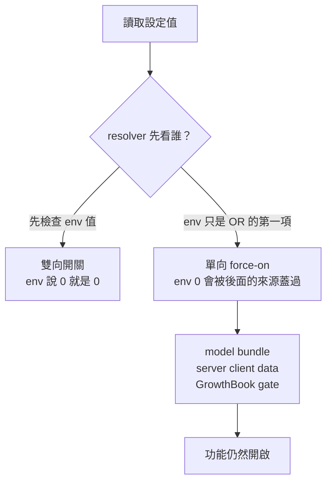

# 原生 Claude Code 的隱藏設定

> 這是 [`HIDDEN_SETTINGS.md`](./HIDDEN_SETTINGS.md) 的繁體中文版本，內容對應同一次分析。
> 所有 prompt 原文、程式碼片段、變數與識別字一律保留原文，因為它們是比對用的證據，翻譯後就無法拿去 grep。

> **釘住的分析對象：** Claude Code `2.1.239`，**macOS arm64**（`darwin-arm64`），SHA-256
> `2b4f7aafdaa65bcc2335f56a4b276317837203f2c5587b1f2a17ca78ad14e36f`，大小 `324973552`，內嵌 build
> revision `9bf8e9521fe06414183309865310e27c9b8db3dd`。以下每一個 offset、gate 名稱與行為描述都只對這顆
> binary 成立。每次改版後都要重跑一次方法。

## 文件目的

這份文件描述原生 Claude Code binary 接受、但官方文件沒有說明的環境變數與 `settings.json` 鍵。兩類名單的收錄標準
並不相同。在 `2.1.239` 的清點中，環境變數必須同時「宣告在 typed schema 裡」且「runtime 真的會讀取」才列入；
settings 鍵只要 schema 接受就列入，這是比較寬鬆的門檻，而二十一個裡面有兩個實際上根本沒有任何 runtime 消費者，
詳見[宣告了但沒人讀的鍵](#兩個宣告了但沒人讀的鍵)。`2.1.240` 的差異比對把第一條規則放寬了一次，收錄了
`CLAUDE_CODE_SABLE_THRUSH`——它是直接讀取、沒有 typed schema 條目的，在出現處也如此標註。

之所以做這份研究，是因為一個 patch binary 的專案必須先知道哪些行為本來就能從外部開關，再決定什麼值得動手改：
一個能翻掉整段 prompt 的旗標，遠比每次改版都要重新套用的 byte patch 便宜、也更耐得住升級。所有發現來自對抽取出的
JS bundle 做靜態追蹤，並用實際 session 的 transcript 交叉驗證。

## 目錄

- [方法與「隱藏」的定義](#方法與隱藏的定義)
- [決定開關是否有效的 gate 分類](#決定開關是否有效的-gate-分類)
- [清點](#清點)
- [案例研究 bash-first 注入](#案例研究-bash-first-注入)
- [搜尋工具被 Bash 取代](#搜尋工具被-bash-取代)
- [伺服器下發的 prompt 文字](#伺服器下發的-prompt-文字)
- [Prompt 與行為類變數](#prompt-與行為類變數)
- [提醒與 attachment 類變數](#提醒與-attachment-類變數)
- [功能與 agent 類變數](#功能與-agent-類變數)
- [未文件化的 settings.json 鍵](#未文件化的-settingsjson-鍵)
- [對 2.1.240 的驗證](#對-21240-的驗證)
- [實務建議](#實務建議)
- [既有研究](#既有研究)

---

## 方法與「隱藏」的定義

原生 binary 是 Bun 打包的單檔執行檔，應用程式的 JS 內嵌其中。這個 repo 本身就有抽取工具，所以不需要執行它就能把
bundle 取出來。比對結果之前請先確認你指的是同一顆檔案——安裝器對每個平台會給出不同的 binary 與 checksum，而
bundle 裡確實有依平台分支的程式碼，所以別的平台的 `2.1.239` 並不是這裡分析的對象：

```bash
# 在 repo 根目錄執行，./scripts 才解析得到
export BIN="$HOME/.local/share/claude/versions/2.1.239"
file "$BIN"            # 預期：Mach-O 64-bit executable arm64
shasum -a 256 "$BIN"   # 預期：2b4f7aaf...ad14e36f

bun -e '
const {readNativeContent} = require("./scripts/native-content.ts");
const h = await readNativeContent(process.env.BIN);
await Bun.write("content-239.js", h.content);
'
```

抽出來是一個 28 MB 的單行 minified 檔案。`Read` 和 `Grep` 對它完全無效，本文所有查詢都是用開視窗的 Perl slurp 做的：

```bash
perl -0777 -ne 'while (/(.{300}SEARCHTERM.{500})/gs) { print "$1\n=====\n" }' content-239.js | head -c 4000
perl -0777 -ne 'if (/(function dci\(\).{0,400})/s) { print $1 }' content-239.js
```

環境變數名稱透過一張產生出來的 export map 進入程式，形如 `CLAUDE_CODE_FOO:()=>xY_`，其 accessor 符號由一個
typed factory 建立：`Ge={str,bool,triBool,int,enum}`。**在 binary 裡找到字串完全不能證明什麼**；一個名稱要被本文
收錄，必須同時具備 typed schema 條目，以及 `G.NAME` 或 `process.env.NAME` 形式的 runtime 讀取。

> **注意：** `G.` 與 `process.env.` 在 `2.1.239` 涵蓋了全部讀取，但更新的版本並非如此——重用這個探針前請先看
> [重跑時會踩到的陷阱](#重跑時會踩到的陷阱)。

> **「隱藏」指的是這顆執行檔認得、而官方文件沒有記載**——對環境變數而言是 runtime 會讀取，對 settings 鍵而言是
> schema 會接受。它**不代表**受支援、穩定或安全。這些都是內部實作細節，Anthropic 隨時可以在下一版改名或刪除。

## 決定開關是否有效的 gate 分類

在動手設定任何一個之前，最該知道的一件事是：它們**並不共用同一套優先序**。主要有兩種形狀，而且在你想「關掉」某個
東西時，兩者的行為完全相反。



雙向那種會在所有來源之前先檢查環境變數的值，所以寫成 false 就一定是 false：

```js
function dci() {
  if (G.CLAUDE_CODE_THRIFTY_SONIC !== undefined) return G.CLAUDE_CODE_THRIFTY_SONIC;
  switch (eES()) { case "forced": return !0; case "none": return !1; case "cohort": return it(oyp, !1) }
}
```

單向那種把環境變數的值和另外三個來源做 OR，所以一個 falsy 的環境變數只會直接落到後面任何一個開啟的來源：

```js
function F3r(e, t, r) { return e || pci(r) || ok()?.[t] === !0 || it(t, !1) }
```

| 形狀 | Parser | 怎麼開 | 怎麼關 |
|---|---|---|---|
| 先檢查 env | `triBool` | `1`、`true`、`yes`、`on` | `0`、`false`、`no`、`off` — 有效 |
| 先檢查 env | `enum` / `int` | 指定的值 | 該列舉的「off」成員，如果有的話 |
| 先檢查 env | `str` | 字串本身 | 依 resolver 而定 — 見下 |
| `F3r` OR 鏈 | `bool` | `1`、`true`、`yes`、`on` | **關不掉** — model bundle 或遠端 gate 仍會贏 |

> ⚠️ **警告：** 每一個走 `F3r` 的代號都是單向 force-on 開關。設 `CLAUDE_CODE_BISON_CAIRN=0` 並不會移除它控制的
> 那段文字，model bundle 可以獨立把它打開。

**決定權在 resolver，不在 parser 型別。** parser 是很強的訊號，但從來不是判準；有一個變數就足以證明：
`CLAUDE_CODE_TOASTY_THIMBLE` 用的是 `str` parser，但它的 resolver 會直接拒絕類布林的寫法，所以 `0` 是有效的
針對性關閉：

```js
function qpT(e) { let t = e.trim(); return jp(t) || Gn(t) ? null : crm(t, "env", void 0) }
function jp(e)  { … return ["0","false","no","off"].includes(String(e).toLowerCase().trim()) }
```

在信任任何一個關閉值之前，先讀它的呼叫點。底下各組的表格記錄的就是每個 resolver 實際接受什麼。

> **注意：** 底下所有「關不掉」的說法，指的都是**針對性**的控制。有一個已文件化的變數能整批壓掉這些段落：
> `CLAUDE_CODE_SIMPLE` 會讓段落組裝在任何一個被求值之前就 early-return，只留下 `CWD:` 與 `Date:`。那不是關掉
> 某一段的方法——它移除的是整個 system prompt 主體。

## 清點

以下數字都是從釘住的那顆 bundle 獨立量測的，沒有沿用任何既有分析的結果。

> **比較的另一邊也釘住了。** Anthropic 的官方文件沒有版本號，所以「不在官方文件中」這類數字，唯有在被比對的
> 名單本身被凍結時才可重現。兩份名單以 2026-08-22 的快照與本文一起提交：
> [`HIDDEN_SETTINGS.public-env-2026-08-22.txt`](./HIDDEN_SETTINGS.public-env-2026-08-22.txt)（178 個名稱）與
> [`HIDDEN_SETTINGS.public-settings-2026-08-22.txt`](./HIDDEN_SETTINGS.public-settings-2026-08-22.txt)（145 個鍵）。
> 沒有它們的話，日後官方文件的異動會與 binary 本身的異動無法區分。每份檔案開頭都有 `#` 的來源標註，名單則在其下
> 以 `LC_ALL=C` 排序。**做集合運算前要先去掉標註**——`comm` 與 `join` 依呼叫端的 collation 比較，而且會把註解行
> 當成資料，直接餵原始檔會得到 `file 1 is not in sorted order`：
>
> ```bash
> body() { grep -v '^#' "$1"; }
> LC_ALL=C comm -13 <(body HIDDEN_SETTINGS.public-env-2026-08-22.txt) <(body runtime-read-names.txt)
> body HIDDEN_SETTINGS.public-env-2026-08-22.txt | LC_ALL=C sort -c   # 驗證排序
> ```

| 量測項目 | 數量 |
|---|---|
| typed env schema 中的 `CLAUDE_CODE_*` | 452 |
| 其中有直接 runtime 讀取的 | 405 |
| 只有 schema、runtime 從不讀取 | 47 |
| 有 runtime 讀取且不在官方環境變數文件中 | 239 |
| 隱藏集合中的 `bool`（單向 force-on 形狀） | 111 |
| 隱藏集合中的 `triBool`（雙向） | 28 |
| 隱藏集合中的 `str` / `int` / `enum` | 70 / 27 / 3 |
| 被窄 scalar 探針比對到的 `settings.json` 根層鍵 | 152[^keys] |
| 未文件化的根層鍵，獨立量測 | 21[^hidden] |

[^keys]: 這是下界，不是總數。該探針只比對 `X:Bt().optional().describe(…)` 形式的 scalar 鍵，會漏掉以 object 或
array schema 形狀宣告的鍵。既有研究回報被接受的根層鍵是 159 個。

[^hidden]: **這 21 個不是那 152 個的子集合。** 它們是拿官方 settings 索引直接與 schema 比對列舉出來的，不是從上
一列的探針結果過濾而來。21 個中只有 9 個會被窄探針比對到；其餘 12 個——包括 `breakReminder`、`quietHours`、
`remote`、`policyHelpers`、`xaaIdp`——是 object 形狀或使用了不同的串接寫法。兩列量的是不同的東西，不可當成
父集合與子集合閱讀。

隱藏集合以 `DISABLE_*`（41）、`ENABLE_*`（14）、`SKIP_*`（12）、`ARTIFACT_*`（12）這幾個前綴為大宗。其中多數是
host 協定欄位、測試 fixture 或遙測管線，而不是使用者會想去設定的東西。

## 案例研究 bash-first 注入

`CLAUDE_CODE_THRIFTY_SONIC` 是隱藏旗標中效果最大、最看得見的一個，也是這份文件存在的原因。當它的 gate 生效時，
處於 `auto` 或 `bypassPermissions` 模式的 session 會收到一段額外的 system prompt attachment：

```text
Do your work through the Bash tool wherever it can accomplish the job: read files with cat, head,
or sed -n, search with grep and find, and make file changes with sed, heredocs, or short scripts,
rather than using the dedicated Read, Edit, or Write tools. Fall back to a dedicated tool only
when Bash genuinely cannot do the job.
```

同一個 gate 也會修剪 Bash 工具的描述，把那份禁令清單拿掉——而那份清單正是平常把編輯行為留在 `Edit` 工具裡的反向
壓力。**有兩個 gate 共同決定這段文字**，所以下表的「預設」欄取決於下一節談的搜尋 gate：在預設的 CLI session 上，
那兩條搜尋禁令在 bash-first 動作之前就已經不存在了。

| 描述中的條目 | 預設 CLI session | 搜尋工具 opt-in 後 | bash-first 生效時 |
|---|---|---|---|
| `IMPORTANT: Avoid using this tool to run …` | 有，列出 `cat, head, tail, sed, awk, echo` | 有，額外列出 `find, grep` | 移除 |
| `File search: Use Glob (NOT find or ls)` | **本來就沒有** | 有 | 移除 |
| `Content search: Use Grep (NOT grep or rg)` | **本來就沒有** | 有 | 移除 |
| `Read files: Use Read (NOT cat/head/tail)` | 有 | 有 | 移除 |
| `Edit files: Use Edit (NOT sed/awk)` | 有 | 有 | 移除 |
| `Write files: Use Write (NOT echo >/cat <<EOF)` | 有 | 有 | 移除 |
| `Communication: Output text directly (NOT echo/printf)` | 有 | 有 | 保留 |

這段 attachment 由一個只在那兩種寬鬆模式下才會執行的 resolver 送出：

```js
async function b_w(e, t) {
  let r = gn(t), n = r.mode === "bypassPermissions";
  if (r.mode !== "auto" && !n) return [];
  let o = n || eA(t.options.mainLoopModel), i = t.options.tools,
      s = i.some(l => ol(l, Ni)) && i.some(l => ol(l, Rl) || ol(l, wu)) && dci();
  if (o && !s) return [];
  return [{type: "auto_mode", autoModeConsentFlow: !n && YMi(t), bashFirst: s, steerOnly: o, bypass: n}];
}
```

實際 session 的 transcript 證實這個旗標真的送達了真實 session。**渲染後的文字不會落盤，但 attachment 物件會**，
所以可以在 `~/.claude/projects/*/*.jsonl` 裡直接 grep `bashFirst`：

```json
{"type":"auto_mode","autoModeConsentFlow":false,"bashFirst":true,"steerOnly":true,"bypass":false}
```

> **注意：** 在 `steerOnly` 模型上，這段 attachment **只有** bash-first 那一段，沒有 "Auto Mode Active" 標題。
> 拿那個標題去搜 transcript，即使注入正在生效也會一無所獲——要搜的是 `"bashFirst":true`。

因為 `dci()` 屬於 env 優先的形狀，`CLAUDE_CODE_THRIFTY_SONIC=0` 確實能同時關掉注入與描述修剪。

## 搜尋工具被 Bash 取代

另有一個獨立 gate 的改動，會把 `Glob` 與 `Grep` **整個從工具清單移除**，使檔案搜尋必須走 Bash 的 `find` 和
`grep`。它很容易和 bash-first 注入搞混，但它有自己的 gate、在**所有**權限模式下都生效，而且沒有對應的環境變數：

```js
function sN() { if (!Gn("true")) return !1; if (A5s()) return !1; return G.CLAUDE_CODE_ENTRYPOINT !== "local-agent" }
```

`A5s()` 是 session 的 `searchToolsOptIn` 旗標，而唯一會設定它的地方是啟動參數解析：

```js
R5s([Jm, Nm].some(p));   // Jm = "Glob", Nm = "Grep"
// p = (Y) => d.includes(Y) || l.some(W => qp(W).toolName === Y)
//     d = 從 --tools 解析出的名稱，l = 從 --allowedTools 解析出的規則
```

所以在命令列指名任一個工具，就能把兩者都放回工具清單：

```bash
claude --allowedTools "Glob" --allowedTools "Grep"
```

但它對 Bash 描述的影響是**有條件的**，因為這兩個 gate 在這裡是巢狀關係而非各自獨立：

```js
let o = WLm();            // bash-first 的描述修剪
if (!o) {                 // 這條禁令只有在 bash-first 關閉時才存在
  let u = sN() ? "`cat`, `head`, `tail`, `sed`, `awk`, or `echo`"
               : "`find`, `grep`, `cat`, `head`, `tail`, `sed`, `awk`, or `echo`";
  i.push(`- IMPORTANT: Avoid using this tool to run ${u} commands, …`);
}
```

bash-first 決定禁令清單**存不存在**，搜尋 opt-in 只決定 `find` 和 `grep` **在不在清單裡**。只要
`THRIFTY_SONIC` 還開著，清單兩種情況下都不會出現，所以要恢復完整措辭必須兩者並用：

| 目標 | 要設什麼 |
|---|---|
| 讓 `Glob` 和 `Grep` 回到工具清單 | `--allowedTools "Glob" --allowedTools "Grep"` |
| 讓禁令清單存在 | `CLAUDE_CODE_THRIFTY_SONIC=0` |
| 讓 `find` 和 `grep` 出現在該清單中 | 以上兩者 |

另有一個相關但不同的機制，`CLAUDE_CODE_REPL`（`triBool`），它不是移除工具，而是把更大一組工具搬到一個 REPL
工具後面：

```js
REPL_ONLY_TOOLS = new Set(["Read", "Glob", "Grep", "Bash", "PowerShell", "NotebookEdit"])
function jj() {
  if (!wae()) return !1;
  if (G.CLAUDE_CODE_REPL === !1) return !1;
  if (G.CLAUDE_CODE_REPL === !0) return !0;
  let e = G.CLAUDE_CODE_ENTRYPOINT;
  if (e === "cli" || e === "remote") return it("tengu_slate_harbor", !1);
  return !1;
}
```

生效時這六個工具會被濾出工具清單，只能在 REPL 工具內以 `await Read({...})` 的形式呼叫。預設值來自
`tengu_slate_harbor` 這個遠端 gate，而 `CLAUDE_CODE_REPL=0` 可以強制關閉。

## 伺服器下發的 prompt 文字

並不是每個 prompt 變動都來自本地旗標。System prompt 有一個 `heron_brook` 插槽，內容由伺服器下發、以 model 與
entrypoint 為鍵，並快取在 `~/.claude.json` 的 `clientDataCacheSlots` 底下：

```js
function Xww(e) {
  let t = ok()?.tengu_heron_brook;                       // 1. 伺服器 client data
  if (typeof t === "string" && t.trim() !== "") { ... return n }
  let r = it("tengu_heron_brook", "");                   // 2. GrowthBook gate
  if (r.trim() !== "") { ... return n }
  if (pci(e)) { ... return Jdh }                         // 3. 內建，僅限 model bundle
  return null;
}
```

第三個分支是一段編譯進 binary 的字串，只送給帶有 `opus_5_prompt_bundle` 標記的模型：

```text
Do not call the AgentTool unless the user requested it
Do not use workflows or deep-research unless the user requested it
```

伺服器下發的版本會蓋過它，而且可能長得多。要看你自己的 profile 收到什麼：

```bash
jq -r '.clientDataCacheSlots | to_entries[]
       | "\(.value.model)/\(.value.entrypoint): \(.value.data.tengu_heron_brook // "(none)")"' ~/.claude.json
```

在這台機器上觀察到的結果是：`claude-opus-5` 搭配 `cli` entrypoint 收到的伺服器文字，在內建那兩行之外，additional
接了一整段關於「turn 數驅動成本」的指示，要求把彼此獨立的工具呼叫——包括讀取、搜尋，以及**對不同檔案的編輯**——
合併在同一則訊息裡發出。這是一股獨立於 bash-first 注入的、形狀類似的批次化壓力，診斷工具選擇行為時務必把兩者
分開來看。

這個插槽沒有對應的環境變數。`CLAUDE_INTERNAL_FC_OVERRIDES` 可以覆寫第 2 步的 GrowthBook gate，但 client data
在它之前被查詢且優先，所以當文字來自伺服器時它幫不上忙。要在本地壓制，只能靠 patch 讓 `Xww()` 回傳 `null`。

---

## Prompt 與行為類變數

這一組改變的是「模型被告知什麼」。九個全部都追到了它實際新增、移除或替換的那段 prompt 字串。

| 變數 | Parser | 關得掉嗎 | 對 system prompt 的作用 |
|---|---|---|---|
| `CLAUDE_CODE_ACT_DONT_REDERIVE` | `triBool` | 可以（**預設是開的**） | 加入一段 279 字元的段落，要求模型直接行動而非重新推導已確立的事實 |
| `CLAUDE_CODE_INTRO_FRAME` | `triBool` | 可以 | 替換開頭那句身分定義 |
| `CLAUDE_CODE_THISTLE_GREBE` | `str` → enum | 兩個方向都能覆寫 | 選擇 subagent 委派的指引 |
| `CLAUDE_CODE_BISON_CAIRN` | `bool` | **不行** | 加入 2 KB 的 `# Delivering work` 段落 |
| `CLAUDE_CODE_LARCH_CISTERN` | `bool` | **不行** | 加入 1.25 KB 的 `# Corrections` 段落 |
| `CLAUDE_CODE_AMBER_ASTROLABE` | `bool` | **不行** | 加入約 1.37 KB 的自主性附錄 |
| `CLAUDE_CODE_GAULT_KESTREL` | `bool` | **不行** | **移除**一句安全護欄 |
| `CLAUDE_CODE_BASALT_COVE` | `bool` | **不行** | 選用擴充版的 `# Communicating with the user` 段落 |
| `CLAUDE_CODE_PARCHMENT_FERN` | `bool` | **不行** | 放寬 Write 與 Edit 描述中關於先讀取的措辭 |

### 三個真的關得掉的

`ACT_DONT_REDERIVE` 的解析是 `env ?? it("tengu_cedar_lantern", true)`——GrowthBook 的預設值是**開**，所以 `0`
是唯一能針對性移除這段文字的方法：

```text
When you have enough information to act, act. Do not re-derive facts already established in the
conversation, re-litigate a decision the user has already made, or narrate options you will not
pursue. If you are weighing a choice, give a recommendation, not an exhaustive survey
```

`INTRO_FRAME` 替換一句話，而且只要有 Output Style 生效它就完全無作用：

| 狀態 | 開場句 |
|---|---|
| 關（預設） | `You are an interactive agent that helps users with software engineering tasks.` |
| 開 | `You are an agent working with the user toward their goals, using your own judgment along the way.` |

`THISTLE_GREBE` 是三者中 fallback 鏈最長的——環境變數、client data、GrowthBook、model floor——而環境變數在所有
來源之前被查詢。它也是這九個裡**唯一能推翻 model 層決定**的：明確設成 `default` 可以打敗某些 model bundle 套用的
`no_nudges` floor。解析出的值在每個 session 首次讀取時就會被 latch 住。

| 值 | 效果 |
|---|---|
| `default` | 正常的鼓勵委派指引；明確設定此值可打敗 model floor |
| `no_nudges` | 從 Glob、Grep、Plan、Agent、ExitPlanMode 的描述中拿掉鼓勵委派的措辭 |
| `counter_steer` | 在上述之外，再加入 1440 字元的 `## Delegating to subagents` 段落，論述不要過度委派 |

> **注意：** 帶有 `opus_5_prompt_bundle` 標記的模型會自己降到 `no_nudges`。如果你什麼都沒改、subagent 的鼓勵
> 措辭卻消失了，原因就在這裡。

`counter_steer` 那段的開頭是：

```text
## Delegating to subagents
Subagents multiply cost and time: each one re-establishes context, re-explores, and reports back,
and you then re-read its report. Delegate only when the payoff clearly exceeds that overhead.
```

### 單向 force-on 的那組

六個變數共用 `F3r` resolver、都關不掉，但**它們做的事情並不同一類**——這個區別在挑選 patch 目標時很關鍵：

| 效果 | 變數 |
|---|---|
| 新增一整段 | `BISON_CAIRN`、`LARCH_CISTERN`、`AMBER_ASTROLABE` |
| 選用既有段落的擴充版本 | `BASALT_COVE` |
| 移除一句 | `GAULT_KESTREL` |
| 替換 Write 與 Edit 描述中的措辭 | `PARCHMENT_FERN` |

`pci(model)` 這一項的意思是：任何 `opus_5_prompt_bundle` 模型都會啟用 `BISON_CAIRN`、`LARCH_CISTERN` 與
`GAULT_KESTREL`，與環境變數無關。

以下是上表前兩列所新增或選用的四個段落：

| 段落 | 開頭 |
|---|---|
| `# Delivering work` | "Do ordinary work as asked, acting on the actual request rather than on speculation about what lies behind it. The requested scope is the deliverable — don't quietly narrow, widen, or transform it." |
| `# Corrections` | "Avoid unnecessary or excessive self-correction. Only correct an earlier statement in your user-facing text when the error would change the user's code, conclusions, or decisions." |
| 自主性附錄 | "You are operating autonomously. The user is not watching in real time and cannot answer questions mid-task, so asking 'Want me to…?' or 'Shall I…?' will block the work." |
| `# Communicating with the user` | "Your text output is what the user reads between tool calls; they usually can't see your thinking or the raw tool results." |

`AMBER_ASTROLABE` 之上還有一個總開關：如果 GrowthBook 旗標 `tengu_amber_sextant` 為 false，自主性附錄根本不會
渲染。它同時也會對 `fable_5_mitigations` 模型與 `claude-mythos-5` 自動開啟——這就是為什麼 Fable session 沒設任何
旗標也帶著這段。

> ⚠️ **`GAULT_KESTREL` 會移除一道護欄。** 它從 action-caution 段落刪掉下面這一句，只留下
> "Before deleting or overwriting, look at the target."：
>
> ```text
> . If what you find contradicts how it was described, or you didn't create it, surface that
> instead of proceeding
> ```
>
> 這一句只存在於 lean prompt 路徑，所以在該路徑之外這個旗標沒有可觀察的效果。不要隨意開啟。

### 一條被推翻的既有描述

`PARCHMENT_FERN` 在別處被描述為「選用更嚴格的 Write／Edit 先讀取措辭」。追蹤結果正好相反：它把先讀取的要求
**收窄**到只針對工作目錄以外的檔案。

| 工具 | 旗標關閉 | 旗標開啟 |
|---|---|---|
| Write | "If this is an existing file, you MUST use the Read tool first…" | "If this is an existing file **outside the working directory**, you MUST use the Read tool first…" |
| Edit | "You must Read the file in this conversation before editing, or the call will fail." | "**If the file is outside the working directory**, you must Read it before editing, or the call will fail." |

而且它**只改描述**。真正的強制錯誤是由 Read 權限範圍決定的，不受這個旗標控制，所以這個變數實際做的事情是讓工具
說明對齊本來就存在的強制行為。對十個舊型號 model id、以及設了 `CLAUDE_CODE_SIMPLE` 時，它會被硬性關閉。

---

## 提醒與 attachment 類變數

這一組控制的是在對話輪次之間注入的 `<system-reminder>` 區塊，另有兩個是改工具描述的。多數是 `triBool`，因此
確實開關得動。

| 變數 | Parser | 關得掉嗎 | 注入或改變什麼 |
|---|---|---|---|
| `CLAUDE_CODE_SILENT_TURN_REMINDER` | `triBool` | 可以 | 在連續數輪沒有使用者可見文字後送出提醒 |
| `CLAUDE_CODE_SILENT_TURN_REMINDER_TEXT` | `str` | 替換文字 | 覆寫該提醒的措辭 |
| `CLAUDE_CODE_SILENT_TURN_REMINDER_TURNS` | `int` ≥ 1 | 不適用 | 沉默門檻，預設 5 |
| `CLAUDE_CODE_TODO_REMINDER_MODE` | `baseline\|off` | `off` 有效 | Todo **與** task 兩種維護提醒 |
| `CLAUDE_CODE_TOTAL_TOKENS_REMINDER` | `str` → enum | `off` 有效 | `<total_tokens>N tokens left</total_tokens>` 區塊本身 |
| `CLAUDE_CODE_TOTAL_TOKENS_REMINDER_BUDGET` | `int` > 0 | 不適用 | `padded-countdown` 的起始預算，預設 15000000 |
| `CLAUDE_CODE_TOTAL_TOKENS_REMINDER_AFTER_USER_TURN` | `triBool` | 可以 | 每個使用者輪次重新錨定預算，預設開 |
| `CLAUDE_CODE_BASH_OUTPUT_AUDIENCE_NOTE` | `triBool` | 可以 | 提醒 Bash 輸出使用者其實看不到 |
| `CLAUDE_CODE_JUNIPER_SUNDIAL` | `int` ≥ 1 | 不適用 | ultracode 提醒重複出現的節奏，預設 10 |
| `CLAUDE_CODE_TOASTY_THIMBLE` | `str` | 類布林值等於停用 | 把任意文字注入成 `batching_reminder` |
| `CLAUDE_CODE_TURN_UPDATES` | `triBool` | 可以 | 換成簡短版的溝通段落 |
| `CLAUDE_CODE_ENABLE_NARRATION` | `triBool` | 可以 | 由側請求產生的 spinner 敘述 |
| `CLAUDE_CODE_GORSE_PLOVER` | `bool` | **不行** | 在 Bash 描述加一行 |

### 你最可能看過的幾個提醒

沉默輪次提醒的觸發條件是：主迴圈連續 `SILENT_TURN_REMINDER_TURNS` 輪既沒有產生使用者可見文字、也沒有符合條件的
工具呼叫，且每個區間最多三次：

```text
The user hasn't heard from you in a while. As you continue, keep them updated when there's
something to tell — a finding, a change of plan.
```

`TODO_REMINDER_MODE=off` 會一次消掉**兩個**提醒，兩者的觸發條件都是「距上次使用相關工具 ≥10 輪，且距上次提醒
≥10 輪」：

```text
The TodoWrite tool hasn't been used recently. If you're working on tasks that would benefit from
tracking progress, consider using the TodoWrite tool to track progress. …
```

`TOTAL_TOKENS_REMINDER` 是那個出現在 system prompt 與每次工具結果之後的 token 區塊的總開關。它的 resolver 先看
環境變數，再看 `totalTokensReminder` 這個 settings 鍵，再看 client data，最後才是 GrowthBook gate：

| 值 | 產生的內容 |
|---|---|
| `padded-countdown` | 預設 — 從 `TOTAL_TOKENS_REMINDER_BUDGET` 開始倒數 |
| `countdown` | 當下剩餘的 context window token 數 |
| `fixed` | 字面值 `5000000` |
| `infinite` | 字面值 `Infinite` |
| `off` | 什麼都不產生 — 區塊消失 |

Bash 輸出提示的觸發條件是這組裡最嚴的——需要互動式 session，且 stdout 超過三行：

```text
Only you see that command's output — the user's terminal shows at most a few lines of it. If the
user needs to read any of it, put it in your reply.
```

### 任意注入通道

隱藏集合裡有**兩個**變數能把你指定的文字放進對話。兩者都抵達同一個 renderer，
`(e) => [An({content: Ov(e.text), isMeta: !0})]`，會把字串包成：

```text
<system-reminder>
{你的字串}
</system-reminder>
```

差別在於是什麼把文字帶到那裡：

| | `TOASTY_THIMBLE` | `SILENT_TURN_REMINDER_TEXT` |
|---|---|---|
| 用途 | 存在的唯一目的就是承載你的文字，沒有內建預設值 | 替換一個本身就有預設文字的提醒的措辭 |
| 觸發時機 | 工具結果輪次之後，每個模型每段對話一次 | 每次沉默輪次提醒觸發時，每區間最多三次 |
| 驗證 | 類布林值 — `1`、`true`、`on`、`0`、`false`、`off` — 全部解析為「沒有自訂提醒」 | 完全沒有：`Eoh()` 原樣回傳環境變數字串，連 trim 和空字串檢查都沒有 |
| 需要搭配旗標 | 否 | 只有在 `SILENT_TURN_REMINDER` 開啟時才有意義 |

`TOASTY_THIMBLE` 另外還會在前面的工具結果包含拒絕或中斷時被跳過。兩個名稱都會被 project 與 local settings 範圍
剝除，所以 repo 無法設定它們。

> ⚠️ **稽核時請把這兩個當成 prompt injection 面來看。** 任何能寫入 user 或 managed settings、或能寫入啟動程序
> 環境變數的東西，都能把任意文字放進 `<system-reminder>` 標籤裡，而模型被訓練成把該標籤內容視為 harness 所撰寫。
> 送達並非無條件——必須是達到上表觸發條件的對話，`TOASTY_THIMBLE` 需要一個工具結果輪次，
> `SILENT_TURN_REMINDER_TEXT` 需要一段沉默區間——但任何實際在工作的 session 都會例行達到這些條件。

> **注意：** 這組裡有四個名稱會被 project 與 local settings 剝除，必須放在 user 或 managed settings：
> `TOASTY_THIMBLE` 以及三個 `SILENT_TURN_REMINDER*`。binary 剝除時會發出警告：
>
> ```text
> CLAUDE_CODE_TOASTY_THIMBLE in .claude/settings.json is ignored — project-scoped settings can't
> set this key. Set it in ~/.claude/settings.json or managed settings instead.
> ```

### 兩個名實不符的名稱

`JUNIPER_SUNDIAL` 解析的常數字面上叫做 `TURNS_BETWEEN_MAINTENANCE`，看起來像是 todo 維護。它不是：它設定的是
ultracode 提醒以簡短形式重複出現前要經過幾則使用者訊息。Todo 與 task 維護用的是另一組常數，固定為十輪且不可設定。

| 提醒 | 文字 |
|---|---|
| 首次（`full`） | "Ultracode is on: optimize for the most exhaustive, correct answer — not the fastest or cheapest. …" |
| 重複（`sparse`，本變數控制） | "Ultracode is still on — use the Workflow tool; see its Ultracode section." |

`ENABLE_NARRATION=1` 並不是單純設定一個 30 秒間隔。GrowthBook 的值只要大於零就會贏，30 秒這個數字只是「明確
啟用、但伺服器值為 `0`」時的 fallback。反方向設成 `false` 則是權威性的關閉。它啟用的東西是一個對次級模型的側
請求，用兩行狀態填滿 spinner：

```text
now: <the sub-goal you are working toward this moment …>
next: <the upcoming sub-goal the conversation above already states …>
```

---

## 功能與 agent 類變數

這一組開關的是功能、工具與指令，而不是編輯 prompt 文字。

| 變數 | Parser | 關得掉嗎 | 控制什麼 |
|---|---|---|---|
| `CLAUDE_CODE_PEWTER_OWL` | `triBool` | 可以 | Brief 模式：純文字輸出對使用者隱藏，`SendUserMessage` 成為可見通道 |
| `CLAUDE_CODE_PEWTER_OWL_TOOL` | `triBool` | 可以 | 只註冊 `SendUserMessage` 工具，不進入 brief 模式 |
| `CLAUDE_CODE_WORKFLOWS` | `triBool` | 可以 | `Workflow` 工具與 `/workflows` 的可用性 |
| `CLAUDE_CODE_WEB_FETCH_AGENT` | `triBool` | 可以 | 內建 `web-fetch` subagent，用來頂替缺席的 `WebFetch` 工具 |
| `CLAUDE_CODE_PLAN_V2_AGENT_COUNT` | `int` | 不適用 | Plan v2 第二階段可平行啟動的 `Plan` agent 數 |
| `CLAUDE_CODE_PLAN_V2_EXPLORE_AGENT_COUNT` | `int` | 不適用 | Plan v2 第一階段可平行啟動的 `Explore` agent 數 |
| `CLAUDE_CODE_EXPERIMENTAL_OBSERVER_AGENTS` | `bool` | 不適用 | agent frontmatter 的 `observer` / `observerMessage` / `observeSubagents` 欄位 |
| `CLAUDE_CODE_NO_MODEL_FALLBACK` | `bool` | **不行** | 禁止模型替換；該輪次改為直接失敗 |
| `CLAUDE_CODE_HARBOR_KITE` | `bool` | **不行** | 跨 session 對等訊息（`ListAgents` / `SendMessage`） |
| `CLAUDE_CODE_HARBOR_KITE_PACING_OFF` | `bool` | **不行** | 關閉對外訊息的 token bucket 節流 |
| `CLAUDE_CODE_WALNUT_SPIRE` | `bool` | **不行** | 早期存取的 `claude plugin eval` |
| `CLAUDE_CODE_LANTERN_PRISM` | `bool` | **不行** | 早期存取的 `/skill-doctor`、`/plugin stats`、plugin manager 的 Usage 分頁 |
| `CLAUDE_CODE_PROACTIVE` | `bool` | **不行** | 把 `assistantMode` 傳進 cron／`/loop` 排程器 |

### Brief 模式是這組裡最大的行為改變

`PEWTER_OWL` 會反轉「使用者看得到的答案住在哪裡」。stop-hook 的文字把這個契約講得很清楚：

```text
In brief mode, plain assistant text is hidden from the user — only SendUserMessage reaches them.
Call it now with your substantive reply for this turn. Do not mention this reminder; the message
should read as if you wrote it unprompted, addressing only what the user actually asked.
```

這兩個變數不能互換。`PEWTER_OWL_TOOL` 註冊的工具帶的是相反的指示——一般答覆仍走普通文字，該工具只用於需要逐字
呈現的內容。

> **注意：** 這兩個變數的環境值都會**短路掉所有否決條件**。非互動檢查與 model 名稱過濾只在變數未設定時才執行，
> 所以一旦設定，即使在原本會拒絕的情境下也會強制生效。

### 兩處對既有描述的修正

Plan v2 的兩個計數曾被描述為「1..10 的整數」。那個範圍是**接受條件，不是 clamp**——`0` 或 `11` 會被整個忽略，
然後落回預設值：

| 變數 | 預設 |
|---|---|
| `PLAN_V2_EXPLORE_AGENT_COUNT` | 3 |
| `PLAN_V2_AGENT_COUNT` | 1，Max 20x／Enterprise／Team 方案為 3 |

兩者在以 agent 為基礎的 Plan v2 路徑未啟用時都無作用；`CLAUDE_CODE_DISABLE_EXPLORE_PLAN_AGENTS` 會把那些階段
換成不用 agent 的 prompt，屆時兩個計數都不會被讀取。

`CLAUDE_CODE_WORKFLOWS=1` 也比看起來弱。它無法覆寫 managed settings、`allow_workflows` 組織政策，或
`enableWorkflows: false`——這三者會先被檢查：

```js
function mH() {
  if (sir()) return !1;          // CLAUDE_CODE_DISABLE_WORKFLOWS 或 managed disableWorkflows
  if (!yUn()) return !1;         // 組織政策 allow_workflows
  let {available: e, defaultOn: t} = A0a();
  if (!e) return !1;
  return F5()?.settings.enableWorkflows ?? t;
}
```

### 一個會讓失敗變大聲的

`NO_MODEL_FALLBACK` 值得知道，是因為它的效果是**硬錯誤**而不是安靜的行為改變。設定之後，原本會轉去其他模型的
輪次會直接失敗：

```text
CLAUDE_CODE_NO_MODEL_FALLBACK is set: model substitution is disabled · unset it to allow the swap
```

Compaction 也會以同樣方式失敗。binary 裡甚至內建一個 tripwire，一旦在保證生效期間走到內部 fallback 路徑就會拋錯。

### 早期存取旗標會自己說明用法

`WALNUT_SPIRE` 內嵌的說明文字直接指出它接受哪些設定範圍，並明確排除 repo 內提交的設定：

```text
Enablement variable for machines that cannot receive the per-organization rollout
(Bedrock/Vertex/Foundry, LLM gateways, telemetry-disabled clients, CI runners):
`CLAUDE_CODE_WALNUT_SPIRE=1`, set in the shell, in `~/.claude/settings.json` under `env`, or in
managed settings `env`. Do not rely on a repository's `.claude/settings.json` (or
`settings.local.json`) `env` for it.
```

---

## 未文件化的 settings.json 鍵

settings schema 會自我說明：每個鍵都帶著 `.describe()` 字串，供內部使用的鍵則以 `@internal` 開頭。有二十一個被
接受的根層鍵不在官方索引中。

| 鍵 | 形狀 | `@internal` | 行為（取自其 describe 字串） |
|---|---|---|---|
| `breakReminder` | object | 是 | 持續使用一段時間後出現的可關閉提示；從不阻擋操作 |
| `quietHours` | object | 是 | 在本地時間區間內的柔性提示 — **這一版沒有接上** |
| `showMessageTimestamps` | boolean | 否 | "Stamp each message with its arrival time" |
| `todoFeatureEnabled` | boolean | 否 | "Enable the todo / task tracking panel" |
| `feedbackDrafts` | `notify\|quiet\|off` | 否 | 模型草擬的回饋；`off` 會整個停用 `SendFeedback` 工具 |
| `precomputeCompactionEnabled` | boolean | 否 | 在背景預先計算 compaction 摘要 |
| `modelSettings` | record | 否 | "Per-model settings keyed by canonical model name" — 目前是 `effortLevel` |
| `autoDreamEnabled` | boolean | 否 | 背景記憶整併；會覆寫伺服器端預設 |
| `doneMeansMerged` | boolean | 是 | 持續工作直到 PR 可合併 — **這一版沒有任何 runtime 消費者** |
| `modelProposedGoals` | `auto\|alwaysAsk\|disabled` | 是 | 控制 `ProposeGoal` 工具；手動輸入的 `/goal` 不受影響 |
| `totalTokensReminder` | enum | 是 | 產生 `<total_tokens>` 區塊 |
| `totalTokensReminderBudget` | 正整數 | 是 | `padded-countdown` 的起始預算，預設 15000000 |
| `totalTokensReminderAfterUserTurn` | boolean | 是 | 每個使用者輪次重新錨定預算；預設開 |
| `autoContinueAtUsageLimit` | boolean | 否 | 等待 claude.ai 用量限制重置後自動繼續 |
| `autoUploadSessions` | boolean | 否 | "Mirror local sessions to claude.ai as view-only (no remote control)" |
| `skipWorkflowUsageWarning` | boolean | 是 | 記錄使用者已接受多 agent workflow 的用量警告 |
| `daemonColdStart` | `transient\|ask` | 否 | 為本次登入 session 啟動背景服務，或詢問是否常駐安裝 |
| `proxyAuthHelper` | string | 否 | 產生 `Proxy-Authorization` 標頭的 shell 指令 |
| `remote` | object | 否 | "Cloud session configuration" — `defaultEnvironmentId` |
| `policyHelpers` | object | 是 | 依作業系統區分的 managed policy helper 與 fallback payload |
| `xaaIdp` | object | 否 | XAA（SEP-990）IdP 連線，供所有啟用 XAA 的 MCP server 共用 |

### 範圍限制

不是每個鍵都能從任何 settings 檔案讀取。三個與同意權相關的鍵只從 `SECURITY_SENSITIVE_SETTING_SOURCES` 讀取，
所以提交進 repo 的值會被安靜忽略：

| 鍵 | 接受的來源 | 忽略的來源 |
|---|---|---|
| `modelProposedGoals` | policy、flag、user | project、local |
| `feedbackDrafts` | policy、flag、user | project、local |
| `autoContinueAtUsageLimit` | policy、flag、user | project、local |
| `skipWorkflowUsageWarning` | policy、flag、user、**local** | project |
| `policyHelpers` | 僅 policy／admin | 其餘全部 |
| 帶 `ccpool_` 前綴的 `remote.defaultEnvironmentId` | policy、flag、user | project、local |

`proxyAuthHelper` 所有範圍都接受，但來源若是 project 或 local，必須先通過工作區信任確認；它同時也在「會產生
子程序的設定」清單中，會被納入信任對話框的指紋計算。

> ⚠️ **有三個鍵帶有實質後果。** `autoUploadSessions` 會把本地 session 內容鏡像到 claude.ai，而 `proxyAuthHelper`
> 與 `policyHelpers` 會執行 shell 指令。這三個都應該當成涉及憑證或隱私的設定看待，而不是便利性開關。

### 兩個宣告了但沒人讀的鍵

兩者都追查過在 bundle 中的每一次出現：

| 鍵 | 出現次數 | 意義 |
|---|---|---|
| `quietHours` | 1 — 只有 schema 定義 | 會被接受與驗證，但從來沒有任何地方讀取它 |
| `doneMeansMerged` | 2 — schema 條目，加上一個沒有對應項目定義的 `Internal` 分組 id | 會被接受，從不讀取 |

在 `2.1.239` 設定這兩個都不會有任何效果。之所以特地列出來，正是因為**一個名稱存在於 schema 中，不構成該行為存在
的證據**——這也正是把 grep 字串當成研究方法會失準的原因。

`xaaIdp` 又是另一種情況：它是有條件地展開進 schema 的，所以環境變數沒有 `CLAUDE_CODE_ENABLE_XAA` 時，這個鍵根本
不存在，會被當成未知鍵拒絕。

---

## 對 2.1.240 的驗證

`2.1.240` 在這份分析完成的隔天釋出。對它重跑差異比對——也就是本文建議的做法——結果是本文記載的所有內容都沒有
行為上的改變。

> **第二個釘住的分析對象：** Claude Code `2.1.240`，**macOS arm64**（`darwin-arm64`），SHA-256
> `8917e01c99ea0ce6ed887a1729a4cda693c758fe542747be71756987b145c772`，大小 `325055632`。以下每一組比較的兩邊
> 都是這個平台，所以差異必然是版本改動而非平台差異。取得同一份檔案：
>
> ```bash
> bash scripts/download-native-from-installer.sh \
>   --platform darwin-arm64 --version 2.1.240 \
>   --output /tmp/claude-240 --manifest-out /tmp/manifest-240.json
> ```
>
> **manifest 要和 binary 一起重導。** 下載器抓的是**請求版本**的 manifest，並且不管 `--output` 指到哪裡都會寫入
> `work/manifest.json`，所以少了 `--manifest-out` 就會覆蓋掉原本與 `work/` 內既有 binary 配對的那份，留下一個
> `2.1.240` 的 manifest 配著一顆較舊的執行檔。

| 量測項目 | 2.1.239 | 2.1.240 |
|---|---|---|
| typed schema 中的 `CLAUDE_CODE_*` | 452 | 453 |
| 其中有直接 runtime 讀取的 | 405 | 406 |
| 本文記載且早於 2.1.240 的變數仍存在[^pop] | — | 37 / 37，parser 型別零變動 |
| 本文記載的 settings 鍵仍存在 | — | 21 / 21 |
| settings 根層鍵，窄 scalar 樣式[^keys] | 152 | 152 |
| 所有帶 `.describe()` 的 schema 屬性[^broad] | 643 | 643 |
| 引用的 prompt 與描述文字 | — | 全部存在 |

[^pop]: 三張分組表中列出的 35 個變數，加上案例研究的 `CLAUDE_CODE_THRIFTY_SONIC` 與搜尋章節的
`CLAUDE_CODE_REPL`。既有研究涵蓋其中 36 個，`CLAUDE_CODE_REPL` 是本文額外記載的。`2.1.240` 新增的兩個變數不列入，
因為對於 `2.1.239` 中不存在的名稱無法做「是否仍存在」的檢查——把它們算進來，本文記載的變數總數是 39。

[^broad]: 這是刻意比上一列更寬的探針：與 constructor 無關，並且計入 bundle 中**每一個** schema 的每一個帶
describe 的屬性，包含巢狀欄位，而不只是 `settings.json` 的根層鍵。它放在這裡是作為整個 schema 表面的穩定性訊號
——請不要拿它去和[清點](#清點)裡使用窄樣式的根層鍵數字比較。

沒有任何東西被移除。本文倚賴的三個 gate 結構完全相同，只有 minified 符號換了位置——這也是為什麼上面引用的程式碼
都標明是 `2.1.239` 的形狀：

| Gate | 2.1.239 | 2.1.240 |
|---|---|---|
| bash-first resolver | `dci()` | `Ici()` |
| 單向 OR gate | `F3r` | `K3r` |
| 搜尋工具 gate | `sN()` | `cN()` |

### 新增了什麼

兩個環境變數，都餵進同一條 thinking 顯示路徑：

| 變數 | 形狀 | 效果 |
|---|---|---|
| `CLAUDE_CODE_THINKING_DISPLAY_UPDATES` | typed，env 優先的雙向開關 | 選擇 thinking 顯示模式：`thinking_and_connector_text`、`connector_text` 或 `none` |
| `CLAUDE_CODE_SABLE_THRUSH` | 直接讀取，**不在 typed schema 中** | 控制 narration summary blocks，餵進同一個 renderer |

> **對本 repo 的提醒：** 這兩者和「讓 thinking 在 UI 即時串流」的 patch 是相鄰的地帶。上游正在同一個表面上長出
> 原生選項，所以未來的 patch 工作應先確認是否重疊，而不要預設該行為仍然無法從設定觸及。

另有五個新的 GrowthBook gate。`tengu_thinking_display_updates` 與 `tengu_sable_thrush` 是上述兩個變數的伺服器端。
其餘三個——`tengu_radiant_island`、`tengu_effort_medium_nudge_shown`、`tengu_effort_medium_nudge_resolved`——屬於
同一個功能：一個關於 effort 等級的 UI 提示，只對 effort 為 `high` **且**是從 user settings 釘住的 session 顯示
（該 cohort 的名稱字面上就叫 `user_pin`），並帶有持久化的 `hasSeenEffortMediumNudge` 旗標。

### 重跑時會踩到的陷阱

`2.1.240` 引入了**第二個指向已解析環境變數物件的別名** `Pu.`，與 `G.` 並存。有二十二個名稱只能透過它取得：

```bash
# 2.1.239 時代的探針在 2.1.240 上會完全漏掉這些
grep -o 'Pu\.CLAUDE_CODE_[A-Z_]*' content-240.js | sort -u | wc -l   # 22
```

本文的數字不受影響——`Pu.` 在 `2.1.239` 中出現零次，所以那個探針對釘住的分析對象是完整的。但如果在 `2.1.240`
或更新的版本上重跑、而只比對 `G.` 與 `process.env.`，就會**安靜地少算**。把總數拿去和上表比較之前，請先確認你
涵蓋了該 build 使用的每一個別名。

---

## 實務建議

只要官方有對應的頂層設定，就用官方的，不要用環境變數別名——有文件的鍵能撐過改版，隱藏名稱不會。這些隱藏控制項
只留給沒有官方開關的行為。

可靠的關閉開關是那些 env 優先的。把它們放進 `~/.claude/settings.json` 的 `env` 區塊，可以一次覆蓋所有 launcher
與桌面版，這是 shell export 做不到的：

```json
{
  "env": {
    "CLAUDE_CODE_THRIFTY_SONIC": "0"
  }
}
```

> **注意：** `settings.json` 的 `env` 值是在啟動時套用到 `process.env`，所以改動只影響**之後**啟動的 session。
> 有少數名稱會被 project 與 local settings 範圍拒絕，必須放在 user 或 managed settings。

三個習慣可以避免出錯：

| 習慣 | 原因 |
|---|---|
| 相信 `=0` 之前先讀 resolver | `F3r` 鏈裡的 `bool` 名稱會無視它；`triBool` 與 enum 控制項會遵守；`str` 控制項則視其呼叫點而定 |
| 對照實際安裝的 binary，不要用過期的副本 | 見下方的陷阱 |
| 每次改版後重跑抽取流程 | 名稱、gate 與 offset 都是內部細節，會無預警移動 |

> ⚠️ **這次研究中讓我得出兩次錯誤結論的陷阱：** 這個 repo 裡的 `work/claude.native.original` 是「最後一次下載的
> 版本」——當時它是 `2.1.207`，而實際安裝的 binary 是 `2.1.239`。分析它得出了一個信心十足、但完全錯誤的
> 「這個旗標已經被移除」的結論。

**要從 binary 本身確認你手上是哪一顆。** `work/manifest.json` 是由下載器的另一個旗標寫入的，可能描述著與它旁邊那顆
binary 完全不同的 release，所以讀它的 `.version` 並不是身分檢查。改用雜湊比對——manifest 每個平台都帶 checksum，
對不上就證明這一對已經不同步：

```bash
jq -r '.platforms["darwin-arm64"].checksum' work/manifest.json
shasum -a 256 work/claude.native.original | cut -d' ' -f1   # 兩者必須相同
```

下載第二個 release 來比對時，**兩個輸出都要重導**。請求版本的 manifest 不管 binary 去哪裡都會被抓取，所以少了
`--manifest-out` 就會覆蓋掉目前與 `work/` 內 binary 配對的那份——接著上面那個配對檢查就會拿新的 manifest 去比對
舊的執行檔：

```bash
bash scripts/download-native-from-installer.sh \
  --platform darwin-arm64 --version 2.1.240 \
  --output /tmp/claude-240 --manifest-out /tmp/manifest-240.json
```

## 既有研究

隱藏旗標的清單先前由
[`charliie-dev/claude-code-hidden-settings`](https://github.com/charliie-dev/claude-code-hidden-settings)
獨立整理過，其分析對象與本文位元組完全相同（同樣的大小、同樣的 SHA-256）。本文從零重做了那份分析並加以延伸。
重做的結果在每一項可核對的數字與主張上都一致：

| 核對項目 | 既有研究 | 本文重做 |
|---|---|---|
| 有 runtime 讀取的 `CLAUDE_CODE_*` | 405 | 405 |
| 隱藏環境變數的存在性與 runtime 讀取 | 36 | 36 / 36 確認 |
| 未文件化的 settings 鍵 | 21 | 21 / 21 存在 |
| 不在官方環境變數文件中的隱藏名稱 | 234 | 239[^gap] |

該研究自己承認的唯一證據缺口是：headless 對 loopback API 執行時始終沒有初始化 Auto Mode attachment，因此
bash-first 的差異只能透過 `bypassPermissions` 分支示範，而 `auto` 分支僅有程式碼追蹤支持。上面案例研究中的
transcript 證據，以真實已驗證 session 補上了這個缺口。

把每個變數追到其呼叫點，發現有五處既有描述需要修正。這些都不改變該研究的結論；它們之所以重要，是因為每一條都會
誤導照著做的人。

| 項目 | 既有描述 | 程式碼實際的行為 |
|---|---|---|
| `PARCHMENT_FERN` | 「更嚴格的先讀取措辭」 | 相反，是放寬——要求收窄到工作目錄以外的檔案，且只改描述 |
| `JUNIPER_SUNDIAL` | 「task maintenance attachment 之間的輪次」 | 設定的是 ultracode 提醒的重複節奏；task maintenance 用的是另一組固定常數 |
| `PLAN_V2_*_AGENT_COUNT` | 「1..10 的整數」 | 是接受條件而非 clamp：超出範圍的值會被忽略並落回預設 |
| `ENABLE_NARRATION` | 「明確啟用時使用 30 秒 fallback 間隔」 | 只有在伺服器間隔為 `0` 時成立；伺服器的正值會贏過明確啟用 |
| `quietHours`、`doneMeansMerged` | 描述為可用的設定 | 存在於 schema 中，但這一版沒有任何 runtime 消費者 |

[^gap]: 這兩個數字量的東西略有不同。本文的比較只使用該研究重印的 178 個公開名稱清單；既有研究另外還比對了
OpenTelemetry 與 provider 的文件頁面以及 changelog，差異即來自於此。
