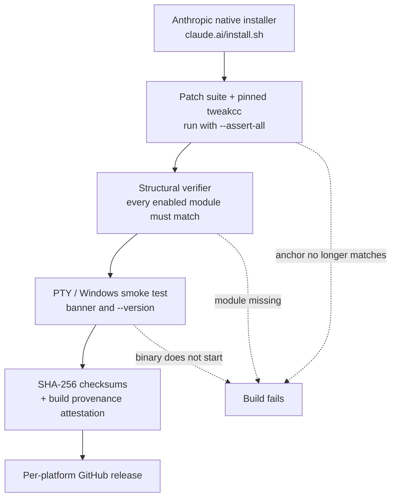

# Calico Claude

> **Calico Claude** is a self-hosted, verifiable supply chain for patched native Claude Code binaries.
> It is a fork of [`a-connoisseur/patch-claude-code`](https://github.com/a-connoisseur/patch-claude-code)
> (reviewed at upstream commit `729494e`). The display patches are unchanged in intent; this fork adds
> its own branding, patch-integrity assertions, dependency pinning, and a CI pipeline that publishes
> SHA-256 checksums plus build provenance attestations. Releases live at
> [`Nanako0129/calico-claude`](https://github.com/Nanako0129/calico-claude).

## Contents

- [What this does](#what-this-does)
- [Install](#install)
- [Keeping it updated](#keeping-it-updated)
- [Trust and security](#trust-and-security)
- [Verify the installed binary](#verify-the-installed-binary)
- [Patch modules in detail](#patch-modules-in-detail)
- [Related research](#related-research)
- [Questions and answers](#questions-and-answers)

---

## What this does

This repo publishes patched native Claude binaries that make output more transparent without verbose
mode, and adds a set of adapters that stay completely dormant unless a launcher such as
[remora](https://github.com/Nanako0129/remora-cc) turns them on. Every change is a local patch to the
binary's own rendering and request-building code; nothing is proxied, and no protocol is modified.

### Display patches (always active)

| Module | Effect |
|---|---|
| `thinking-inline` | Renders thinking blocks inline instead of hiding them behind transcript mode |
| `thinking-streaming` | Streams thinking live, so a 10-minute think shows progress instead of a silent spinner |
| `redacted-thinking-inline` | Renders redacted thinking summaries inline as thinking text |
| `subagent-prompt` | Shows subagent `Prompt:` blocks outside transcript mode |
| `tool-call-verbose` | Forces verbose rendering of collapsed read/search tool calls |
| `create-diff-colors` | Renders created files through the diff component with `+` lines |
| `word-diff-line-bg` | Keeps the muted `+`/`-` line background in word-diff mode |
| `disable-spinner-tips` | Disables spinner tips regardless of settings |
| `compact-tokens-saved` | Reports how many tokens `/compact` actually saved, as the Claude mobile app does |
| `disable-bash-first` | Defaults upstream's Bash-first tool steer off; `CLAUDE_CODE_THRIFTY_SONIC=1` opts back in |
| `background-agent-usage` | Accounts terminal stream usage in the background agent progress row |
| `statusline-committed-usage` | Exposes only committed terminal assistant usage to status-line payloads |
| `statusline-rate-limit-windows` | Forwards the Fable 5 and usage-credit rate-limit windows to status-line payloads |
| `version-output` | Appends `(patched)` to plain `--version` output |
| `disable-official-updater` | Never runs Anthropic's embedded updater, in the background or through `claude update`, and disables `claude install`, which would put the official build over a Calico one; plugin and marketplace auto-update keep working |
| `welcome-badge` | Renames the startup and help titles to `Calico Claude` |

> **Note:** `tool-call-verbose` is **disabled in published releases** (thinking-only expansion, by
> maintainer preference). The CI workflow and the verifier read the same `DISABLED_MODULES` value, so
> the two never drift apart.

### Opt-in adapters (dormant by default)

Each of these changes nothing at all unless its trigger is present in the process environment.

| Module | Trigger | Effect |
|---|---|---|
| `custom-context-window` | `CALICO_MODEL_CONTEXT_WINDOWS` | Uses an exact model-to-window map instead of the stock 200K assumption |
| `active-turn-prompt-id` | `REMORA_ACTIVE=1` | Exposes Claude's own prompt UUID to a compatible gateway as `x-calico-prompt-id` |
| `compact-request-source` | `REMORA_ACTIVE=1` + `compact` query source | Sends `x-calico-request-source: compact` so a gateway can apply class-level stream guards |
| `compact-body-policy` | `REMORA_ACTIVE=1` + `CALICO_COMPACT_*` | Rewrites the full outbound compact JSON body before it leaves the process |
| `gateway-fast-mode` | `REMORA_ACTIVE=1` | Applies `service_tier: "priority"` from remora's shared request-time worker state |

> The startup banner reflects the **branding** patch only. An older build can print `Calico Claude`
> while lacking a newer adapter entirely — see [Verify the installed binary](#verify-the-installed-binary).

---

## Install

### macOS and Linux

```bash
curl -fsSL https://raw.githubusercontent.com/Nanako0129/calico-claude/main/install-patched-claude.sh | bash
```

This installs Calico **side by side** as `calico-claude` and keeps it updated. The official `claude`
is never written: it stays under Anthropic's own installer and updater, and the two never touch each
other's files. Run Calico by the new name, or point a launcher at it (remora's
`runtime.claude_binary`, a shell alias):

```toml
[runtime]
claude_binary = "/absolute/path/to/.local/bin/calico-claude"
```

What the installer creates, all under your home directory:

| Path | What it is |
|---|---|
| `~/.local/bin/calico-claude` | The launcher, a symlink to the current build |
| `~/.local/share/calico-claude/versions/` | Installed builds (the newest three are kept) |
| `~/.claude/calico/update.sh` | The updater ([`examples/local-auto-update/`](./examples/local-auto-update/)) |
| `~/.claude/calico/config` | `repo=<owner>/<name>`, the only place the hook and the timer read the repo from |
| `~/.claude/calico/source-commit` | The commit the installer and updater were fetched from |
| `~/.claude/settings.json` | One `SessionStart` hook entry, added to what is already there |
| `~/.claude/settings.json.calico-bak` | The file as it was before the hook was added (mode `0600`) |
| `~/Library/LaunchAgents/com.calico.auto-update.plist` | macOS only: the hourly timer, loaded as `gui/<uid>/com.calico.auto-update` |
| `~/Library/Logs/calico-auto-update.log` | macOS only: the timer's log |

The installer prints this list with your paths when it finishes, together with the exact uninstall
command.

How it runs:

1. It refuses to run as root or under `sudo`, and under Git Bash on Windows.
2. It resolves `main` to one commit SHA with a single GitHub API call, then downloads the updater
   (and on macOS the launchd template) from `raw.githubusercontent.com/<repo>/<sha>/`. Every file
   comes from that one commit, even if `main` moves during the run.
3. It writes the config and the updater, then runs the updater once with `--force`, which downloads
   the latest release for your platform and verifies it before installing (see
   [Keeping it updated](#keeping-it-updated)).
4. It adds the `SessionStart` hook to `~/.claude/settings.json`, and on macOS loads the launchd timer.

To track a fork, set `PATCH_CLAUDE_REPO` (or `CALICO_REPO`) to `<owner>/<name>` when you run the
installer. It is written to `~/.claude/calico/config`; the hook and the timer ignore the variable
itself.

The installer makes one GitHub API call. It takes the first credential available, in this order:
`GITHUB_TOKEN`, then `GH_TOKEN`, then an authenticated `gh` (`gh auth token`). With none, the request
is anonymous and shares GitHub's limit of 60 an hour per address, which a VPN or office NAT can
exhaust for everyone behind it. The token reaches `curl` on stdin rather than on its command line,
where other local users could read it through `ps`.

Requirements: `bash`, `curl`, `python3`, and `shasum` (macOS) or `sha256sum` (Linux). `gh` is optional
but recommended; see [Keeping it updated](#keeping-it-updated) for what changes without it.

> **Prefer not to pipe a script from the internet?** Use the manual path below. The binaries are built
> in GitHub Actions and the patcher is readable and modifiable, so convenience is the only reason to
> trust this repo's release builds over your own.

#### Uninstall

```bash
curl -fsSL https://raw.githubusercontent.com/Nanako0129/calico-claude/main/install-patched-claude.sh | bash -s -- --uninstall
```

The installer prints the same command pinned to the commit it installed from. It removes only what
the installer created: the hook entry (other hooks and settings are left as they were), the launchd
timer and its plist and log, the launcher, the installed builds, and `~/.claude/calico/`. The
official `claude` is not touched, and `settings.json.calico-bak` is left in place.

#### Restoring the official build after an earlier in-place install

Earlier versions of this installer wrote the Calico build over `claude` itself. The current one does
not touch it, but it does check: if `claude --version` prints `(patched)`, it says so. To put the
official build back, run Anthropic's installer, which downloads the official build and runs its own
`install`, then check that `claude --version` no longer prints `(patched)`:

```bash
curl -fsSL https://claude.ai/install.sh | bash
claude --version
```

### Windows

Unchanged for now: the PowerShell installer still installs **in place**, over the `claude.exe` that
Anthropic's updater manages. A side-by-side installer like the macOS/Linux one is planned.

Calico patches the **native** build. If Claude Code came from npm, replace it first:

```bash
npm uninstall -g @anthropic-ai/claude-code
curl -fsSL https://claude.ai/install.sh | bash
claude --version
```

```powershell
irm https://raw.githubusercontent.com/Nanako0129/calico-claude/main/install-patched-claude.ps1 | iex
```

It detects the CPU architecture and downloads the patched release matching the installed Claude Code
version. When an immutable rebuild such as `-2` exists, it selects the highest published rebuild
suffix. Calico builds never run Anthropic's updater themselves (`disable-official-updater`), so an
installed build stays patched but does not upgrade itself either; see
[Keeping it updated](#keeping-it-updated). Listing releases uses the GitHub API with the same
credential order as above; the PowerShell installer makes the request in-process and starts no
subprocess for it.

### Manual, from releases

| Platform | Release tag suffix | Asset |
|---|---|---|
| macOS arm64 | `macos-arm64` | `claude.native.macos.patched` |
| Linux x64 | `linux-x64` | `claude.native.patched` |
| Linux arm64 | `linux-arm64` | `claude.native.patched` |
| Windows x64 | `win32-x64` | `claude.native.windows.patched.exe` |
| Windows arm64 | `win32-arm64` | `claude.native.windows.patched.exe` |

On macOS and Linux, install it under its own name so the official `claude` stays under Anthropic's
updater:

```bash
# Linux
install -m 0755 ./claude.native.patched ~/.local/bin/calico-claude
~/.local/bin/calico-claude --version
```

```bash
# macOS
install -m 0755 ./claude.native.macos.patched ~/.local/bin/calico-claude
xattr -d com.apple.quarantine ~/.local/bin/calico-claude 2>/dev/null
~/.local/bin/calico-claude --version
```

A binary installed this way does not update itself; the updater in
[`examples/local-auto-update/`](./examples/local-auto-update/) can take it over.

On Windows, download the asset from the release matching your installed Claude version, then:

```powershell
# Windows
$target = (Get-Command claude).Source
Move-Item $target "$target.calico-old.$([DateTimeOffset]::UtcNow.ToUnixTimeMilliseconds())"
Copy-Item .\claude.native.windows.patched.exe $target
claude --version
```

Windows will not overwrite `claude.exe` while any Claude Code session is running it, but it will
rename it, which is why the old file is moved aside first. Sessions already open keep running the old
build until restarted; delete the `claude.exe.calico-old.*` file once they have exited. If the copy
fails, delete whatever it left at `$target` and move the `.calico-old.*` file back to that name. The
installer does all of this itself, including removing leftovers from earlier runs.

---

## Keeping it updated

### macOS and Linux

The installer wires this up; there is nothing to do by hand. Two triggers run the updater:

| Trigger | Mode | When |
|---|---|---|
| `SessionStart` hook in `~/.claude/settings.json` | `--hook` | When a Claude Code session starts, at most once an hour. It starts a detached update and returns at once, so it never delays startup. |
| launchd timer (macOS only) | `--unattended-run` | Every hour, and once when it is loaded. Without it, a release published while you are not starting sessions waits until you next do. |

Linux gets the hook only.

The hook entry the installer writes is:

```json
{"type": "command", "command": "/bin/bash \"/Users/you/.claude/calico/update.sh\" --hook", "timeout": 10, "async": true}
```

Re-running the installer updates that entry in place rather than adding a second one; an entry from
the earlier manual setup (`bash ~/.claude/calico/update.sh --hook`) is replaced the same way.

Before anything is installed, the updater verifies the release checksum and, when an authenticated
`gh` is available, the build provenance attestation, pinned to this repo's release workflow on `main`.
The downloaded build is then run and must report the exact expected version plus `(patched)`; only
after that does the launcher symlink move. A build that fails leaves the launcher untouched, so there
is nothing to roll back. An updated build is picked up by the next session, not the running one.

> **Without `gh`, provenance is not checked.** When `gh` is missing or not logged in, the updater logs
> `WARNING: gh unavailable or not authenticated; skipping attestation verification` and installs on
> the checksum alone. The checksum is published in the same release as the build, so anyone able to
> publish a release can publish a matching checksum with it: in that configuration a compromised
> release is installed. This is an accepted risk, not an oversight. Install `gh` and run
> `gh auth login` to close it. The launchd timer starts with a clean environment, so for the timer
> the login must be stored by `gh auth login`; a `GH_TOKEN` exported in your shell does not reach it.

The updater's own reference, including its logs and every mode, is
[`examples/local-auto-update/README.md`](./examples/local-auto-update/README.md).

### Windows

Unchanged for now. Calico builds never run Anthropic's embedded updater: neither in the background
nor through `claude update`, which prints that it is a Calico build and installs nothing.
`claude install` is disabled the same way, because it would put the official build at the official
location, over a Calico build installed there. Plugin and marketplace auto-update are unaffected. So
a build installed over `claude.exe` is no longer reverted by its own sessions, but it also does not
upgrade itself. The PowerShell installer picks the Calico release matching the version
`claude --version` reports, so re-running it on its own reinstalls the same version. To move to a
newer Claude Code, install it first with Anthropic's installer, then re-run the Calico installer.
Sessions that were already running before the install still run the previous build, and if that
build is an official one its updater can still replace yours, so restart them after installing.
`update.ps1` in [`examples/local-auto-update/`](./examples/local-auto-update/#windows) can maintain a
side-by-side `calico-claude.exe` by hand.

---

## Trust and security

Calico replaces the native Claude Code executable, so installing it is a supply-chain decision rather
than a normal configuration change. Every release passes the same gates:



| Gate | What it guarantees |
|---|---|
| `--assert-all` during patching | A patch whose upstream anchor no longer matches fails the build instead of silently applying nothing |
| Structural verifier | Every enabled module is present in the produced binary, by symbol and shape |
| PTY / Windows smoke test | The patched binary actually starts and renders the expected banner |
| Pinned dependencies | The patcher version is fixed per build and recorded in the release metadata |
| SHA-256 + attestation | The published asset matches its checksum and provably came out of this repo's CI |

> ⚠️ **Before installing:** review the workflow and patch source, verify the release checksum and
> attestation, and keep a reinstall path for the official Claude binary. remora's approval-gated
> installer deliberately does not install Calico on your behalf.

The context adapter is dormant by default. It never contacts a server and never reads credentials; it
only accepts a child-process environment map. Exact model matching, bounded integer validation,
malformed-input fallback, and remora's binary capability check together prevent a broad or silent
context increase.

---

## Verify the installed binary

Check the release SHA-256 and the GitHub attestation first. Then, from a source checkout, run the
structural verifier against the exact binary you intend to use:

```bash
node scripts/verify-patched-binary.ts \
  --input "$(command -v calico-claude)" \
  --disable tool-call-verbose
```

> **A `(patched)` version label alone is not sufficient.** The banner comes from one module; the
> adapters are separate ones. Treat the verifier's per-module report as the capability check —
> `active-turn-prompt-id`, `background-agent-usage`, `statusline-committed-usage` and
> `custom-context-window` must all report `ok`.

remora users can run `remora doctor --online` instead.

### Live thinking in the UI

Streaming thinking also needs one Claude setting, in `~/.claude/settings.json`,
`.claude/settings.json`, or `.claude/settings.local.json`:

```json
"showThinkingSummaries": true
```

---

## Patch modules in detail

### Background-agent token usage

Claude Code's native background tracker samples assistant usage as stream messages arrive.
OpenAI-compatible gateways can create the assistant wrapper with provisional `0/0` usage and then
deliver authoritative accounting later — in a terminal `message_delta`, or by mutating that same
wrapper after the tracker already sampled it. The foreground summary reads the finalized wrapper
eventually, but the live background row would show elapsed time with no token count.

Calico tracks usage by response ID across three sources and refreshes at both the progress and the
completion seam, deduplicating output tokens seen through more than one path.

| Source | Role |
|---|---|
| `message_start` | Opens the response record, usually provisional |
| Terminal `message_delta` | Authoritative accounting for the response |
| Completed assistant wrapper | Covers gateways that mutate the wrapper in place |

The displayed total preserves Claude Code's native semantics: latest response input and cache tokens,
plus cumulative output across the background agent's turns. This changes local accounting only.

| Verifier requires | Regression tests cover |
|---|---|
| `__calicoTrackAgentUsage` | Provisional `0/0` |
| `__calicoRefreshAgentUsage` | Terminal accounting |
| Response-output deduplication map | Late wrapper mutation |
| Both refresh seams | Repeated deltas, direct completed wrappers, multi-turn totals |

### Committed status-line usage

The canonical query-stream assistant wrapper starts with a shared mutable commit cell:

```js
__calicoUsageState: { committed: false, usage: null }
```

> **Why an object rather than a boolean:** Claude Code shallow-copies the provisional wrapper into app
> state before the terminal event arrives. A primitive top-level flag would stay stale in those copies
> even after the canonical wrapper commits; the shallow copies retain the *cell reference*.

A trusted terminal `message_delta` writes both `committed: true` and the exact aggregated usage
snapshot into that cell. Downstream tool-input and fallback transforms synchronize the same cell, and
the status-line selector projects the saved snapshot instead of trusting later mutations.

**When is a terminal event trusted?** Both conditions must hold:

| Condition | Requirement |
|---|---|
| Raw usage is not the all-zero sentinel | See the sentinel table below |
| Aggregated usage has real accounting | Any non-zero `input_tokens`, `output_tokens`, cache creation, or cache read |

**What counts as the all-zero sentinel:**

| Field | Sentinel requirement |
|---|---|
| `input_tokens` | Explicit numeric `0` — a *missing* field disqualifies |
| `output_tokens` | Explicit numeric `0` — a *missing* field disqualifies |
| Flat cache creation / read | May be omitted or zero |
| `cache_creation.ephemeral_1h_input_tokens` | May be omitted or zero |
| `cache_creation.ephemeral_5m_input_tokens` | May be omitted or zero |
| Any of the above non-zero | Not a sentinel |

The raw guard is required because Claude's `xAe` aggregation can retain positive message-start or
previous-turn values when a synthetic terminal event reports all zeros.

**How each wrapper is classified:**

| Wrapper origin | Classification |
|---|---|
| Terminal `message_delta`, trusted | **Committed** — projected to the status line |
| `message_start` | Provisional |
| Content-block cleanup | Provisional |
| UI-only thinking / responding virtual message | Ignored |
| `message_stop` cleanup | Ignored |
| Direct stream-error synthesized stop reason | Ignored |
| Exact all-zero `[DONE]` fallback | Ignored |

**What the status line shows:**

| State | Display |
|---|---|
| Before the first committed response | Unknown |
| A later turn still provisional | Previous committed usage |
| A later untrusted all-zero delta arrives | Previous committed usage — the snapshot is monotonic |
| Partial-zero but valid (`input > 0`, `output = 0`) | Committed normally |

The selector only projects committed snapshots from the already-sliced message array Claude Code
supplies, so compaction boundaries stay owned by the existing `kb()` slice and are never searched
across by the new helper.

The verifier checks the shared commit cell, terminal snapshot mutation, downstream clone
synchronization, selector replacement, and the *absence* of message-stop and UI-reducer commits.

### Fable 5 and usage-credit rate-limit windows

Claude Code parses four rate-limit windows from response headers into one internal state object, then
projects only two of them into the status-line payload:

| Window | Upstream key | Stock Claude Code | With this patch |
|---|---|---|---|
| Session | `five_hour` | Projected | Projected |
| Weekly | `seven_day` | Projected | Projected |
| "Fable 5 limit" | `seven_day_overage_included` | Parsed, then dropped | Projected |
| Usage credit | `overage` | Parsed, then dropped | Projected |

The patch appends the two missing windows in the same shape and under their upstream key names, and
widens the payload guard so a payload carrying only a Fable or credit window still emits
`rate_limits`. There is no extra request and no extra per-render work — the data is already parsed by
the time the payload is built.

Windows appear only when the server sends the corresponding headers for that account; otherwise the
payload is unchanged. Because upstream key names are preserved, a status line written against this
patch keeps working if Anthropic later forwards the same windows itself.

The verifier requires all four forwarded windows, the widened `rate_limits` guard, and the absence of
the original two-window guard.

### Optional custom-model context windows

Stock Claude Code safely treats an unknown custom model id as a 200K model. Calico can instead use an
exact model-to-window map when the gateway advertises a larger operational ceiling:

```bash
export CALICO_MODEL_CONTEXT_WINDOWS='{"gpt-5.6-sol":372000}'
export CALICO_CONTEXT_DISPLAY_PERCENT=95
export CLAUDE_CODE_AUTO_COMPACT_WINDOW=372000
export CLAUDE_AUTOCOMPACT_PCT_OVERRIDE=90
claude --model gpt-5.6-sol
```

| Property | Behavior |
|---|---|
| Parsing | Local; no network |
| Accepted keys | Exact model ids only |
| Accepted values | Integer windows from 100K through 1M |
| Malformed input | Falls back to stock Claude Code behavior |
| `CALICO_CONTEXT_DISPLAY_PERCENT` | Affects the status-line denominator only |
| Output reserve / precompute buffer | Bypassed in this mode, so the compact percentage applies once to the raw mapped window |

With the values above, status-line consumers see 353.4K usable tokens and compaction starts at 334.8K.

> **remora users:** select its `calico` context mode instead of exporting these manually. The default
> remora `stock` mode does not require Calico and stays capped at Claude Code's native 200K.

### Optional active-turn identity

Claude Code already maintains a prompt UUID across the initial model request and its tool-result
continuations. With `REMORA_ACTIVE=1`, Calico exposes it to a compatible gateway:

| Header | Value |
|---|---|
| `x-calico-prompt-id` | Claude's own prompt UUID for the active turn |
| `x-calico-active-turn-version` | `1` |

| Query source | Receives the headers? |
|---|---|
| `main` | Yes |
| `subagent` | Yes |
| Quota checks | No |
| Token counting | No |
| Compaction | No |
| Side queries | No |

Excluding auxiliary traffic is deliberate: those requests must not read or overwrite agentic turn
state. Spawned agents freeze the prompt UUID in their async context and nested agents inherit the
frozen parent value, so a background agent keeps its original turn identity even if the main session
accepts a later user prompt.

| Property | Behavior |
|---|---|
| Adapter marker | `calico-active-turn-adapter:v1` |
| Patch gate | Requires **both** the AsyncLocalStorage capture and the HTTP header anchors |
| If either upstream shape changes | The module applies nothing and the release build fails |
| `ANTHROPIC_CUSTOM_HEADERS` override | Impossible — Calico values are written after custom headers |
| Codex backend state | Not stored, not forwarded |
| Plain Calico launch (no `REMORA_ACTIVE`) | Neither header is emitted |

A compatible gateway must still capture and replay the server-issued `x-codex-turn-state`; the Calico
header only provides the Claude-side turn boundary.

### Optional remora compact policy

When `REMORA_ACTIVE=1` and Claude's query source is `compact`, Calico sends
`x-calico-request-source: compact` so a gateway can apply class-level stream guards (absolute
duration, no retry) without rewriting product fields, and wraps the Anthropic client `fetchOverride`
so the **full** outbound JSON body is rewritten before the request leaves the process.

Body policy comes from the remora child process environment, not from the gateway:

| Variable | Default | Effect |
|---|---|---|
| `CALICO_COMPACT_EFFORT` | `medium` | Sets `output_config.effort` and top-level `effort` when present |
| `CALICO_COMPACT_MODEL` | empty | When non-empty, overrides top-level `model`; empty keeps the session model |
| `CALICO_COMPACT_DISABLE_THINKING` | off | Set `1` to force `thinking: { "type": "disabled" }` when present; unset keeps session thinking |

Main, subagent, quota and side-query traffic is never rewritten. Plain Calico launches without
`REMORA_ACTIVE=1` keep stock compact behavior.

---

## Related research

[`HIDDEN_SETTINGS.md`](./HIDDEN_SETTINGS.md) maps the environment variables and `settings.json` keys
the native binary accepts but the public reference does not document, pinned to `2.1.239` and
re-verified against `2.1.240`. It matters here because a patch is the expensive way to change
behavior: the document separates the controls that genuinely switch something off from the codenames
that only force things on, so anything already reachable from configuration does not need a patch
that has to be re-applied every release.

The comparison inputs are committed alongside it, so the counts can be re-derived rather than taken
on trust. A Traditional Chinese version is at
[`HIDDEN_SETTINGS.zh-TW.md`](./HIDDEN_SETTINGS.zh-TW.md).

---

## Questions and answers

### Does Calico send prompts or credentials anywhere?

No. Calico is a patched native Claude Code executable, not a gateway or hosted service. The build
pipeline downloads Anthropic's native binary, applies reviewable local patches, and publishes the
result. Claude Code still sends data to whichever provider or gateway its runtime configuration
selects.

### Does Calico itself route Claude Code to OpenAI models?

No. OpenAI routing comes from a launcher such as remora plus an Anthropic-compatible gateway. Calico
contributes UI transparency, optional custom-model context handling, and a stable prompt identity for
compatible active-turn bridges.

### Will Claude Code updates remove the patches?

No. On macOS and Linux Calico is installed as `calico-claude`, a name Anthropic's updater does not
manage, and the Calico updater never writes `claude`. On Windows the installer still writes over
`claude.exe`: Calico builds never run Anthropic's updater, but a session of an official build that
was already open, or any other official build on the machine, can install a new version over it.

### Why can the startup banner say Calico while a newer adapter is missing?

The branding patch and the functional adapters are separate modules. An older Calico build can still
print the patched banner while lacking a later `custom-context-window` or `active-turn-prompt-id`
module. Use the [verifier](#verify-the-installed-binary), not the banner.

### Does the active-turn adapter bypass Codex quota limits?

No. It only exposes Claude's existing prompt boundary to a compatible gateway. The gateway must
preserve the server-issued Codex state, and OpenAI still decides whether a recognized turn may
continue under fair-use policy.
